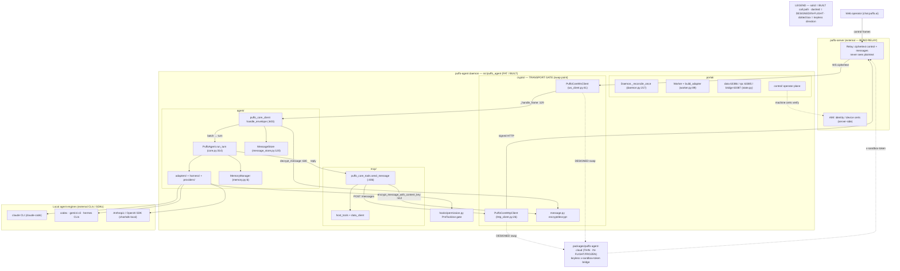
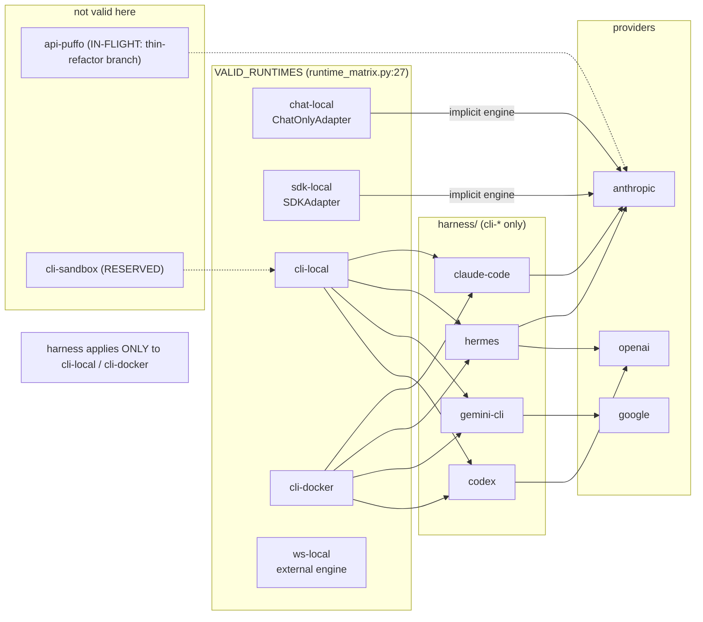
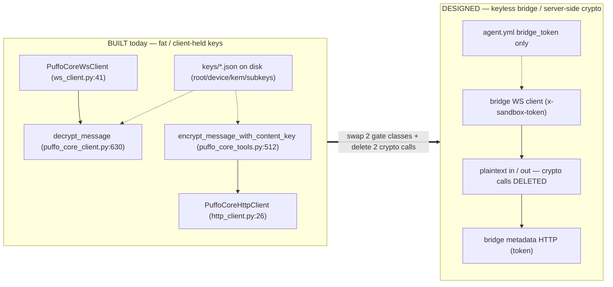
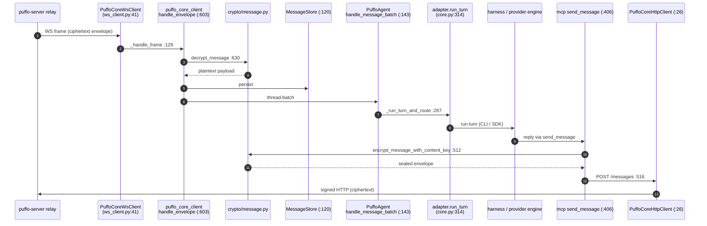
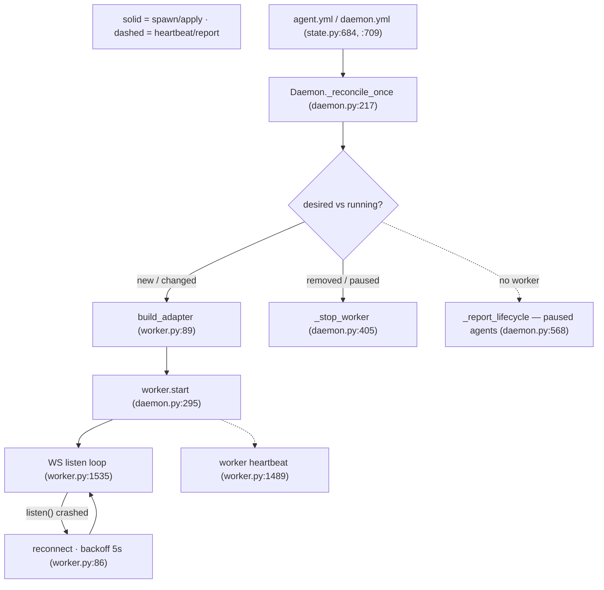

# puffo-agent — Architecture

> **Canonical reference** for the Python `puffo-agent` (`src/puffo_agent/`).
> Every claim is cited `file:line` against the tree at branch tip `54895f3`.
> This document **supersedes** `docs/agent-portal-architecture.svg` (v0.4) — see
> [Supersession note](#supersession-note-v04-svg).
>
> **Citation convention:** all `file:line` references are relative to the package
> root **`src/puffo_agent/`** — e.g. `agent/core.py:314` resolves to
> `src/puffo_agent/agent/core.py:314`. Thin-package references (`packages/…`) are
> explicitly labeled IN-FLIGHT and live on branch `fleet/puffo-agent-thin-refactor`,
> not this branch.

## BUILT vs DESIGNED — read this legend first

This doc is honest about currency. Every status marker below is used consistently
throughout:

| Marker | Meaning |
|---|---|
| **BUILT** | On this branch (`54895f3`), running today. |
| **IN-FLIGHT** | On a separate open branch / PR, not yet on `main`. |
| **DESIGNED** | A written design (roadmap doc), no code on any branch yet. |
| **RESERVED** | A named-but-unimplemented placeholder in code. |
| **FROZEN** | Kept as a v0 reference; not the forward path. |

Load-bearing status calls (details in each section):

- Fat `src/puffo_agent/` daemon — **BUILT**.
- Thin `packages/puffo-agent-cloud/` (keyless, 2-tool) — **IN-FLIGHT** (branch
  `fleet/puffo-agent-thin-refactor`, "Stage A"), also **FROZEN as v0 reference**
  per the fat-cloud design.
- Fat-cloud keyless transport swap (`x-sandbox-token` bridge) — **DESIGNED**
  (`roadmap/cloud-agent/FAT-CLOUD-ADAPTER-DESIGN.md`).
- Memory: flat `MemoryManager` — **BUILT**; the M1–M4 memory tree + tools —
  **IN-FLIGHT** (`pyagent-memory-m1`).
- `api-puffo` runtime — **IN-FLIGHT** (valid only on the thin-refactor branch;
  *not* in `VALID_RUNTIMES` on this branch). `cli-sandbox` runtime — **RESERVED**.
- LiteLLM VK gateway (`ANTHROPIC_BASE_URL`) and E2B cloud sandbox — **DESIGNED**
  cloud touchpoints; no code on this branch.
- `/v1/llm/complete` LLM endpoint — thin-package-only; **retired** in the fat
  direction.

---

## 1. Overview + mental model

**puffo-agent is a fat local daemon that supervises N end-to-end-encrypted agents.**
The operator drives agents remotely (from `chat.puffo.ai`); **puffo-server is a blind
relay** — it moves ciphertext control frames and messages it cannot read. All E2E
crypto lives on the client (this daemon), keyed by material on disk.

The daemon (`portal/daemon.py`) reconciles a set of agents from config; each agent
runs in a `Worker` (`portal/worker.py`) that owns a WS listen loop to the relay, an
**adapter** (the thing that actually runs a turn), and heartbeats. Inbound messages
are decrypted, stored, batched per thread, and handed to a turn; the turn's reply is
sealed and POSTed back through the relay. An in-process **MCP** tool suite gives the
agent its messaging + host tools.

**The one-liner for the roadmap:** today the crypto is *fat* (client-held keys, this
daemon does every encrypt/decrypt). The cloud direction is to keep this exact Python
agent but **swap the transport for a keyless bridge** where the server holds the
crypto and the sandbox speaks plaintext (`x-sandbox-token`). That swap is **DESIGNED,
not built** — and the seam it swaps at is deliberately narrow (§6).

### Reading order / navigation

1. This overview + the [component diagram](#diagram-a--componentcontainer) for the
   map.
2. §2 component-by-component for what each package is.
3. §4 the runtime × harness × provider matrix — the single most important table for
   "how does an agent actually run".
4. §6 the crypto/transport seam — the fat-cloud swap point.
5. §5 message lifecycle + §7 provisioning — the two hot paths.
6. The [Where does X happen?](#12-where-does-x-happen-index) index when you need a
   specific entry point fast.

---

## 2. Component-by-component

Altitude is subsystem-level: what the package does, its entry symbol(s) with
`file:line`, and how other packages call in. (Helper modules — `_time.py`,
`_visibility.py`, `encoding.py`, `fingerprint.py`, `names.py`, etc. — are summarized
by their package, not enumerated.)

### `portal/` — the daemon, workers, services, control plane

The supervisor. Owns process lifecycle and every long-running service.

- **`portal/daemon.py`** — `class Daemon` (`daemon.py:64`). `_reconcile_once`
  (`daemon.py:217`) diffs desired-vs-running agents, constructs a `Worker`
  (`daemon.py:286`) and calls `worker.start()` (`daemon.py:295`); `_stop_worker`
  (`daemon.py:405`) tears one down. For *paused* agents (no worker) the daemon still
  emits a lifecycle heartbeat via `_report_lifecycle` (`daemon.py:568`).
- **`portal/worker.py`** — `class Worker` (`worker.py:561`) and the free function
  `build_adapter` (`worker.py:89`) that maps `runtime.kind` → an `Adapter`. The worker
  runs the reconnecting WS listen loop (`worker.py:1535`, backoff
  `RECONNECT_BACKOFF_SECONDS = 5.0` at `worker.py:86`) and the heartbeat task
  (`worker.py:1489`).
- **`portal/runtime_matrix.py`** — the validation core (§4). `VALID_RUNTIMES`
  (`runtime_matrix.py:27`), `HARNESS_PROVIDERS` (`runtime_matrix.py:69`),
  `validate_triple` (`runtime_matrix.py:146`).
- **`portal/state.py`** — config model + on-disk layout: `daemon_yml_path`
  (`state.py:684`), `agent_yml_path` (`state.py:709`), `DaemonConfig`
  (`state.py:816`), `BridgeConfig` (`state.py:795`), and the three service ports (§9).
- **`portal/data_service.py`** (`DataServiceConfig`, port `63386`, `data_service.py:30`)
  and **`portal/rpc_service.py`** (port `63385`) — the MCP-facing loopback services.
- **`portal/api/`** — the optional local bridge/API on `63387`: `server.py`
  wires routes (`api/server.py:30`), `auth.py` verifies signed requests
  (`make_auth_middleware`, `api/auth.py:74`), `certs.py`/`ownership.py` establish who
  owns an agent (§8).
- **`portal/ws_local/`** — the ws-local runtime's server side: `route.py`'s
  `WS_LOCAL_PATH = "/v1/ws-local"` (`ws_local/route.py:50`), mounted on the 63387
  bridge (§9). External tools speak this to consume an agent over localhost WS.
- **`portal/control/`** — the operator→machine control plane (`agent_create.py`,
  `agent_message.py`, `reporter.py`, `envelope.py`, `machine_auth.py`; §8).
- **`portal/credential_refresh.py`** — daemon-owned Claude/Codex OAuth refresh
  (`credential_refresh.py:1`), single-writer so rotating refresh tokens aren't
  clobbered.
- **`portal/ui/`** — the optional PyQt tray/launcher (`main_window.py`, `tray.py`,
  `daemon_thread.py`). Operator convenience; not on any message path.
- Other portal modules: `cli.py` (the `puffo-agent` CLI), `background.py`,
  `profile_sync.py`, `import_agents.py`, `export.py`, `diagnostic.py`,
  `migration_certs.py`, `host_mcp_handler.py`.

### `agent/` — the turn engine, transport client, adapters, harnesses

What runs *inside* a worker.

- **`agent/core.py`** — `class PuffoAgent` (`core.py:71`). The turn boundary:
  `handle_message` (`core.py:105`) / `handle_message_batch` (`core.py:143`) →
  `_run_turn_and_route` (`core.py:287`) → `self.adapter.run_turn(ctx)` (`core.py:314`).
- **`agent/puffo_core_client.py`** — the E2E messaging client. Registers the inbound
  `handle_envelope` callback (`puffo_core_client.py:603`) which decrypts
  (`puffo_core_client.py:630`), and owns the outbound fallback reply path
  `send_fallback_message` (`puffo_core_client.py:3609`).
- **`agent/adapters/`** — one adapter per runtime kind, all implementing
  `Adapter.run_turn` (`agent/adapters/base.py:65`): `ChatOnlyAdapter`
  (`chat_only.py:15`), `SDKAdapter` (`sdk.py:27`), `LocalCLIAdapter`
  (`local_cli.py:154`), `DockerCLIAdapter` (`docker_cli.py:139`), plus
  `cli_session.py` (long-lived claude CLI session with `--resume`) and
  `desired_install.py` (skills/MCP install into the agent home).
- **`agent/harness/`** — the *engine inside a CLI runtime*: `Harness` ABC
  (`harness/base.py:36`), `build_harness` registry (`harness/__init__.py:20`), and the
  four concrete harnesses `ClaudeCodeHarness` (`harness/claude_code.py:14`),
  `HermesHarness`, `GeminiCLIHarness`, `CodexHarness`. Each declares
  `supported_providers()` so the matrix rejects bad triples.
- **`agent/providers/`** — direct model SDK clients for the non-CLI runtimes:
  `AnthropicProvider` (`providers/anthropic_provider.py:4`, `complete()` at line 9)
  and `OpenAIProvider`.
- **`agent/message_store.py`** — `class MessageStore` (`message_store.py:120`): the
  per-agent `messages.db` behind data_service.
- **`agent/memory.py`** — `class MemoryManager` (`memory.py:6`): the **BUILT** flat
  memory (§ Memory).
- **`agent/skills_loader.py`** — `class SkillsLoader` (`skills_loader.py:9`); plus
  `model_catalog.py`, `events.py`, `disk_cache.py`, `status_reporter.py`,
  `file_browser.py`, `shared_content.py`, `cli_bin.py`.

### `crypto/` — transport gate classes + the message crypto primitives

The E2E layer. Two responsibilities kept apart: *transport* (crypto-agnostic) and
*message crypto* (the actual seal/open).

- **`crypto/http_client.py`** — `class PuffoCoreHttpClient` (`http_client.py:26`):
  every signed HTTP call to the relay. Signs via `http_auth.sign_request`; crypto-
  agnostic transport.
- **`crypto/ws_client.py`** — `class PuffoCoreWsClient` (`ws_client.py:41`): the
  subkey-signed WS handshake and inbound frame delivery. `_handle_frame`
  (`ws_client.py:129`) hands each envelope up to the agent's `handle_envelope`.
- **`crypto/message.py`** — the two message-crypto functions the whole app pivots on:
  `decrypt_message` (`message.py:244`, IN) and
  `encrypt_message_with_content_key` (`message.py:120`) / `encrypt_message`
  (`message.py:108`, OUT).
- **`crypto/keystore.py`** (`class KeyStore`, `keystore.py:80`),
  **`crypto/http_auth.py`** (`sign_request`, `http_auth.py:44`, ed25519),
  **`crypto/certs.py`** (`create_subkey_cert`, `certs.py:28`),
  `primitives.py`, `canonical.py`, `attachments.py`, `v2_aad.py` — the identity +
  signing + canonicalization stack (§8).

### `mcp/` — the in-process tool suite

- **`mcp/puffo_core_server.py`** — `build_server` (`puffo_core_server.py:224`)
  assembles a `FastMCP` server that registers the messaging tools
  (`register_core_tools`, from `puffo_core_tools.py`) and host tools
  (`_install_skill`, `_install_mcp_server`, `_write_refresh_model_flag`, … from
  `host_tools.py`).
- **`mcp/puffo_core_tools.py`** — `register_core_tools` (`puffo_core_tools.py:368`)
  exposes `send_message` (`puffo_core_tools.py:406`) and
  `send_message_with_attachments` (`puffo_core_tools.py:951`) — the **OUT seal** lives
  here (§6).
- **`mcp/host_tools.py`** — skills/MCP install + credential-refresh flags
  (`_install_skill`, `host_tools.py:171`).
- **`mcp/data_client.py`** — `class DataClient` (`data_client.py:72`): the tool-side
  client that reads history from data_service on `63386` (`get_channel_history`
  `data_client.py:122`, `get_dm_history` `data_client.py:153`).

### `hooks/` — the permission gate

- **`hooks/permission.py`** — the Claude Code **PreToolUse** hook proxy: `_deny`
  (`permission.py:49`), `_allow` (`permission.py:57`), `_fail_open`
  (`permission.py:38`). Exit `2` = deny, exit `0` + allow-JSON = allow. Fails **open**
  on proxy-side failures.

### `macos/` — platform credential storage

- **`macos/keychain.py`** — macOS Keychain read/write for credentials, so refresh
  tokens live in the OS keystore rather than plaintext on disk.

### `packages/puffo-agent-cloud/` — the thin cloud runtime *(IN-FLIGHT / FROZEN)*

**Not on this branch.** Lives on `fleet/puffo-agent-thin-refactor` ("Stage A" of a uv
workspace refactor). A slim, **keyless** runtime: a 2-tool loop
(`send_message` + fetch, in `puffo_agent_cloud/tools.py`) driven by `runner.py`, with
a `CloudBridgeClient` that authenticates with an **`x-sandbox-token`** header
(server holds the crypto) and a `CloudLLMClient` that POSTs `/v1/llm/complete`
(`packages/puffo-agent-cloud/src/puffo_agent_cloud/cloud_client.py`). Per the
fat-cloud design it is **FROZEN as the v0 reference**; its transport is what the fat
agent will borrow (§11). Its `/v1/llm/complete` LLM path is **retired** in the fat
direction.

---

## Diagram (a) — component/container

*Packages, external deps, and the trust boundary. Solid = built call path; dashed =
DESIGNED/in-flight direction. Node labels carry the entry symbol.*

---

## 3. The runtime × harness × provider matrix

This is the model to internalize. **Runtime answers WHERE the agent executes; harness
answers WHAT engine runs inside it; provider answers WHICH model vendor.**

`portal/runtime_matrix.py` is the single source of truth. On this branch:

- **`VALID_RUNTIMES` = 5** (`runtime_matrix.py:27`): `chat-local`, `sdk-local`,
  `cli-local`, `cli-docker`, `ws-local`.
- **`RESERVED_RUNTIMES` = {`cli-sandbox`}** (`runtime_matrix.py:35`) — named, **not
  implemented** (the placeholder for E2B-style cloud sandboxing).
- A **6th runtime, `api-puffo`** (cloud-hosted, bearer `session_token`, **no subkey
  signing**), is **IN-FLIGHT**: it is added to `VALID_RUNTIMES` on the
  `fleet/puffo-agent-thin-refactor` branch, and appears only in worker comments here
  (`worker.py:838`, `worker.py:1235`). *It is not a valid runtime on this branch.*

**Harness is meaningful for only two runtimes.** `_HARNESS_BEARING_RUNTIMES` =
{`cli-local`, `cli-docker`} (`runtime_matrix.py:79`); `harness_applies`
(`runtime_matrix.py:85`) returns False for everything else. For `chat-local` /
`sdk-local` the engine is implicit (a direct provider SDK) and the `harness` field is
ignored; `ws-local` brings its own external engine.

**Harness → provider bindings** (`HARNESS_PROVIDERS`, `runtime_matrix.py:69`):

| Harness | Providers | Engine invocation |
|---|---|---|
| `claude-code` | anthropic | long-lived `claude` CLI, stream-json, `--resume` (`cli_session.py`) |
| `hermes` | anthropic, openai | one-shot `hermes chat -q <msg>` per turn |
| `gemini-cli` | google | `gemini` CLI |
| `codex` | openai | `codex` CLI, opt-in, honors `--sandbox` policy (`state.py:991`) |

Defaults: `DEFAULT_PROVIDER_FOR_RUNTIME` (`runtime_matrix.py:97`, all → anthropic),
`DEFAULT_HARNESS_FOR_PROVIDER` (`runtime_matrix.py:105`: anthropic → claude-code,
openai → hermes, google → gemini-cli). `validate_triple` (`runtime_matrix.py:146`)
rejects mismatched (runtime, provider, harness) at config load.

**Adapter dispatch** (`build_adapter`, `worker.py:89`): `chat-local` →
`ChatOnlyAdapter`, `sdk-local` → `SDKAdapter` (needs an anthropic api_key),
`cli-local`/`cli-docker` → CLI adapters that authenticate via the host's
`~/.claude/.credentials.json` (`claude login`) — **no api_key is threaded through the
CLI runtimes**.

## Diagram (c) — runtime × harness matrix

*Which runtimes take a harness, and which providers each harness can drive. Dotted =
IN-FLIGHT/RESERVED.*

---

## 4. The crypto / transport seam *(the fat-cloud swap point)*

All E2E crypto flows through **two gate classes** plus **exactly two message-crypto
call sites**. This narrowness is the whole reason the cloud pivot is cheap.

**The two gate classes** (crypto-agnostic transport):

- `crypto/http_client.py` → `class PuffoCoreHttpClient` (`http_client.py:26`) — signs
  and sends every HTTP call to the relay.
- `crypto/ws_client.py` → `class PuffoCoreWsClient` (`ws_client.py:41`) — the
  subkey-signed WS handshake and inbound frame delivery.

**The two message-crypto call sites:**

- **IN (decrypt):** `agent/puffo_core_client.py` `handle_envelope`
  (`puffo_core_client.py:603`) calls `decrypt_message` (`puffo_core_client.py:630`) →
  plaintext payload. The envelope arrives from `PuffoCoreWsClient._handle_frame`
  (`ws_client.py:129`).
- **OUT (seal):** `mcp/puffo_core_tools.py` `send_message` (`puffo_core_tools.py:406`)
  seals with `encrypt_message_with_content_key` (`puffo_core_tools.py:512`) then POSTs
  to `/messages` (`puffo_core_tools.py:516`). The **fallback** reply path
  `send_fallback_message` (`puffo_core_client.py:3609`) seals with `encrypt_message`
  (`puffo_core_client.py:3728`).

> **Correction of upstream summaries:** the OUT seal is
> `encrypt_message_with_content_key` (content-key wrapping), *not* bare
> `encrypt_message`; and `send_fallback_message` lives in
> `agent/puffo_core_client.py` (:3609), *not* in `mcp/`. Both verified against code.

**The DESIGNED swap** (`roadmap/cloud-agent/FAT-CLOUD-ADAPTER-DESIGN.md`): replace the
two gate classes with bridge-backed impls and **delete the two encrypt/decrypt calls**
— the bridge delivers/accepts plaintext, the server does all crypto
(`x-sandbox-token`). Everything above the seam (`agent/core.py` turn loop, adapters,
`portal/*`, `mcp/*`, memory) survives unchanged. **This is DESIGNED, not built.**

## Diagram (e) — fat-cloud transport swap (before → after) *(DESIGNED)*

---

## 5. Message lifecycle

### 5.1 Message IN → turn (flow 1) and OUT → send (flow 2)

**IN:** relay → `PuffoCoreWsClient` (`ws_client.py:41`) → `_handle_frame`
(`ws_client.py:129`) → `handle_envelope` (`puffo_core_client.py:603`) →
`decrypt_message` (`puffo_core_client.py:630`) → persisted to `MessageStore`
(`message_store.py:120`) → **thread-batched** → `PuffoAgent.handle_message_batch`
(`core.py:143`) → `_run_turn_and_route` (`core.py:287`) → `adapter.run_turn`
(`core.py:314`).

**OUT:** during the turn the agent calls the MCP `send_message` tool
(`puffo_core_tools.py:406`) → seal via `encrypt_message_with_content_key`
(`puffo_core_tools.py:512`) → signed `POST /messages` through `PuffoCoreHttpClient`
(`puffo_core_tools.py:516`) → relay → recipient. If the turn ends without an explicit
send, the daemon's fallback `send_fallback_message` (`puffo_core_client.py:3609`)
seals and posts the reply.

### 5.2 Think-path (flow 3): adapter / harness → model

`adapter.run_turn` (`core.py:314`) dispatches by runtime:

- `chat-local` / `sdk-local` → a direct provider SDK (`AnthropicProvider`,
  `providers/anthropic_provider.py:4`).
- `cli-local` / `cli-docker` → a harness (`harness/base.py:36`) that spawns the vendor
  CLI (claude / codex / gemini / hermes). Claude auth comes from the host
  `~/.claude/.credentials.json`, refreshed by the daemon (`credential_refresh.py:1`).
- `ws-local` → the external tool brings its own engine over `/v1/ws-local`.

> **Currency:** the DESIGNED cloud think-path (`ANTHROPIC_BASE_URL` → LiteLLM virtual
> key) is **not on this branch** — grep finds no `ANTHROPIC_BASE_URL`. Today the CLI
> harnesses use local vendor credentials; LiteLLM VK is a DESIGNED cloud touchpoint.

## Diagram (b) — message round-trip *(sequenceDiagram)*

---

## 6. Provisioning + lifecycle (flow 4)

The daemon reconciles agents; each running agent is one worker.

- `Daemon._reconcile_once` (`daemon.py:217`) diffs desired vs running. New agent →
  `Worker(...)` (`daemon.py:286`) + `worker.start()` (`daemon.py:295`). Removed/paused
  → `_stop_worker` (`daemon.py:405`).
- `build_adapter` (`worker.py:89`) constructs the runtime-appropriate adapter.
- The worker's **WS listen loop** reconnects on failure (`worker.py:1535`, backoff
  `RECONNECT_BACKOFF_SECONDS = 5.0`, `worker.py:86`) and reports errors on the agent
  row (`reporter.report_error`).
- **Heartbeats:** a running worker heartbeats (`worker.py:1489`) and the status
  reporter runs its own loop; for **paused** agents (no worker) the daemon still emits
  a lifecycle heartbeat via `_report_lifecycle` (`daemon.py:568`) so the operator's
  portal sees status.
- Control-plane ops (pause/resume/restart/archive/create/migrate) arrive as encrypted
  command envelopes and are verified + applied by `portal/control/` (§8).

## Diagram (d) — provisioning + lifecycle

---

## 7. Config → behavior (flow 5)

On-disk `daemon.yml` (provider keys, defaults; `state.py:684`) and per-agent
`agent.yml` (identity, `runtime`, triggers, state; `state.py:709`) load into
`DaemonConfig` (`state.py:816`) and the per-agent config. The `runtime` block
(`kind` + `provider` + `harness` + `model` + `sandbox`) is validated by
`validate_triple` (`runtime_matrix.py:146`) — an invalid runtime, an unsupported
harness→provider pair, or a harness on a non-CLI runtime is rejected at load.
`build_adapter` (`worker.py:89`) then turns the validated `runtime.kind` into a
concrete adapter. Legacy `kind` values are migrated by `migrate_legacy_kind`
(`runtime_matrix.py:121`).

---

## 8. Auth / trust boundary (flow 7)

**TODAY (BUILT): client-held keys + certs + operator attestation.** puffo-server is a
blind relay; trust is anchored in on-disk key material and self-signed certs verified
end-to-end.

- **Identity/keys:** `KeyStore` (`crypto/keystore.py:80`, `load_identity` at :99) holds
  root/device/kem secrets + session subkeys under `keys/*.json`.
- **Request signing:** every HTTP call is ed25519-signed (`sign_request`,
  `crypto/http_auth.py:44`); the WS handshake is subkey-signed (`ws_client.py:41`).
- **Certs:** `create_subkey_cert` (`crypto/certs.py:28`); server-side verification
  mirrored locally in `portal/api/certs.py` — `verify_identity_cert`
  (`api/certs.py:23`), `verify_slug_binding` (`api/certs.py:57`),
  `verify_device_cert` (`api/certs.py:94`).
- **Ownership:** `agent_owner_root_pubkey` (`api/ownership.py:21`) derives an agent's
  owner from its on-disk identity — no forgeable `owner_slug` field.
- **Operator control:** commands arrive as encrypted envelopes; `verify_control_cert`
  (`control/envelope.py:38`) + `decrypt_command` (`control/envelope.py:66`) gate them,
  and machine attestation is `machine_cert` (`control/machine_auth.py:23`). The local
  bridge (63387) enforces signatures via `make_auth_middleware` (`api/auth.py:74`).
- **Credential storage:** macOS Keychain (`macos/keychain.py`); OAuth refresh is
  daemon-single-writer (`credential_refresh.py:1`).
- **AIM** is puffo-server's server-side identity/device-cert authority; puffo-agent
  trusts it transitively through the cert chain it verifies locally.

**DIRECTION (DESIGNED): keyless `x-sandbox-token` bridge.** In the fat-cloud design the
daemon holds *no* private keys — the server does all crypto and the sandbox
authenticates with a bearer `x-sandbox-token` (see the thin package's
`CloudBridgeClient`,
`packages/puffo-agent-cloud/src/puffo_agent_cloud/cloud_client.py`, IN-FLIGHT branch).
`keys/*.json`, `crypto/{primitives,message,certs,http_auth,…}` become deletable.
**Designed, not built.**

---

## 9. MCP tools + skills (flow 8)

An in-process **MCP** server gives each agent its tool surface. `build_server`
(`mcp/puffo_core_server.py:224`) composes:

- **Messaging tools** (`register_core_tools`, `puffo_core_tools.py:368`):
  `send_message` (`:406`), `send_message_with_attachments` (`:951`) — these are the
  OUT seal (§6).
- **Host tools** (`mcp/host_tools.py`): install skills / MCP servers into the agent
  home (`_install_skill`, `host_tools.py:171`), toggle credential-refresh flags.
- **Data reads** go through `DataClient` (`mcp/data_client.py:72`) → **data_service on
  63386** (`get_channel_history` `:122`, `get_dm_history` `:153`); RPC control
  (install/sync MCP) goes to **rpc_service on 63385**.
- **Skills** are loaded by `SkillsLoader` (`skills_loader.py:9`) and materialized into
  the agent home by `desired_install.py` (`write_desired_skill`
  `adapters/desired_install.py:127`, `install_claude_mcp` `:214`).
- **Permission gate:** the claude-code harness routes every tool call through the
  **PreToolUse** hook `hooks/permission.py` (`_deny` `:49` / `_allow` `:57`).

### Ports (three loopback services)

| Service | Port | Defined | Purpose |
|---|---|---|---|
| data_service | **63386** | `state.py:782` (`data_service.py:30`) | message/history reads for tools |
| rpc_service | **63385** | `state.py:791` | install/sync MCP RPCs |
| bridge / API | **63387** | `state.py:807` | optional local bridge; **off by default** |

**ws-local has no own port** — it is mounted at `GET /v1/ws-local` on the 63387 bridge
(`WS_LOCAL_PATH`, `ws_local/route.py:50`, wired at `api/server.py:40`).

---

## 10. Memory (flow 6)

- **BUILT — flat `MemoryManager`** (`agent/memory.py:6`): globs `*.md`
  (`memory.py:13`) from a per-agent memory dir into a flat `{topic: content}` map;
  `get_context()` (`memory.py:21`) inlines them into the system prompt; `save()`
  (`memory.py:29`) writes one `.md` per topic. No hierarchy, no recall tooling.
- **IN-FLIGHT — the M1–M4 memory tree + tools** (`pyagent-memory-m1`, open PR): the
  designed hierarchical memory with typed entries and recall tools. **Not merged**;
  the flat manager above is what runs today.

---

## 11. External deps wiring (flow 9)

| Dependency | Role | How puffo-agent touches it | Status |
|---|---|---|---|
| **puffo-server** | blind relay: WS control + message relay + signed HTTP | `PuffoCoreWsClient` (`ws_client.py:41`), `PuffoCoreHttpClient` (`http_client.py:26`) | BUILT |
| **AIM** | server-side identity / device-cert authority | trusted transitively via cert-chain verify (`api/certs.py`) | BUILT (external) |
| **claude CLI** | claude-code harness engine | `cli_session.py` stream-json + `--resume`; auth via `~/.claude/.credentials.json` | BUILT |
| **codex / gemini / hermes CLIs** | codex / gemini-cli / hermes harness engines | spawned per turn (`harness/*.py`) | BUILT |
| **macOS Keychain** | OS credential store | `macos/keychain.py` | BUILT |
| **LiteLLM (VK gateway)** | model gateway via `ANTHROPIC_BASE_URL` | *no code on this branch* | **DESIGNED** (cloud) |
| **E2B** | cloud sandbox | *no code on this branch*; `cli-sandbox` is the RESERVED placeholder, `cli-docker` is the built local container | **DESIGNED** (cloud) |

---

## Fat vs thin + the cloud direction

- **Fat** — `src/puffo_agent/`: this daemon, client-held keys, does all crypto.
  **BUILT.**
- **Thin** — `packages/puffo-agent-cloud/`: a slim, keyless 2-tool runtime
  (`runner.py` loop over `tools.py`'s `send_message`+fetch; `CloudBridgeClient` with
  `x-sandbox-token`; `CloudLLMClient` → `/v1/llm/complete`). **IN-FLIGHT** on
  `fleet/puffo-agent-thin-refactor`, and **FROZEN as v0 reference** per the design.
- **The pivot** (`roadmap/cloud-agent/FAT-CLOUD-ADAPTER-DESIGN.md`): build the fat
  cloud agent *from this Python fat agent* and swap its transport for the thin line's
  keyless bridge (§6 diagram e). The thin `/v1/llm/complete` LLM path is **retired**
  in the fat direction (the fat agent keeps the claude-code harness). **DESIGNED.**

---

## 12. Where does X happen? (index)

| Question | Answer (`file:line`) |
|---|---|
| Where is an inbound message decrypted? | `agent/puffo_core_client.py:630` (`decrypt_message`) |
| Where is an outbound reply sealed? | `mcp/puffo_core_tools.py:512` (`encrypt_message_with_content_key`) |
| Where does a turn actually run? | `agent/core.py:314` (`adapter.run_turn`) |
| Where are messages batched into a turn? | `agent/core.py:143` (`handle_message_batch`) |
| Where is the runtime/harness/provider validated? | `portal/runtime_matrix.py:146` (`validate_triple`) |
| Which runtimes take a harness? | `portal/runtime_matrix.py:79` (`_HARNESS_BEARING_RUNTIMES`) |
| Where does the daemon spawn a worker? | `portal/daemon.py:286` → `:295` (`worker.start`) |
| Where is the adapter chosen for a runtime? | `portal/worker.py:89` (`build_adapter`) |
| Where does the WS reconnect loop live? | `portal/worker.py:1535` (backoff `:86`) |
| Where are the loopback service ports set? | `portal/state.py:782` / `:791` / `:807` (63386/63385/63387) |
| Where is ws-local mounted? | `portal/ws_local/route.py:50` + `portal/api/server.py:40` |
| Where is an HTTP request signed? | `crypto/http_auth.py:44` (`sign_request`) |
| Where is an agent's owner derived? | `portal/api/ownership.py:21` |
| Where is an operator command verified/decrypted? | `portal/control/envelope.py:38` / `:66` |
| Where is (flat) memory loaded into context? | `agent/memory.py:21` (`get_context`) |
| Where are tools registered for the agent? | `mcp/puffo_core_server.py:224` (`build_server`) |
| Where is the PreToolUse permission decision made? | `hooks/permission.py:49`/`:57` |
| Where is Claude OAuth refreshed? | `portal/credential_refresh.py:1` |

---

## Supersession note (v0.4 SVG)

This document **supersedes** `docs/agent-portal-architecture.svg` (labeled **v0.4**),
which has been deleted.

**What the old SVG got right** (and this doc preserves): the blind-relay E2EE framing
("puffo-server relays control frames it cannot read", "never sees plaintext"); the
control-client → agent-workers → **MCP loopback** shape; the three ports
(data **63386**, rpc **63385**, bridge **63387**, off by default); and the
HPKE-verify / ±5-min-timestamp / replay-nonce control-frame guards.

**What was stale / incomplete** in v0.4: it showed only **3 worker kinds**
(claude · codex · ws-local) and no harness dimension — the current system is the
**5-runtime `VALID_RUNTIMES` matrix** (+ `api-puffo` in-flight, `cli-sandbox`
reserved) crossed with **4 harnesses**; it omitted the **adapter/harness split**,
**memory**, and the entire **fat-vs-thin cloud direction** (the keyless transport
swap). Those are all covered above.
