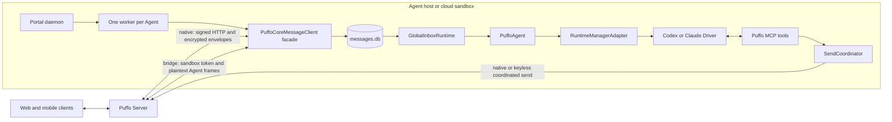
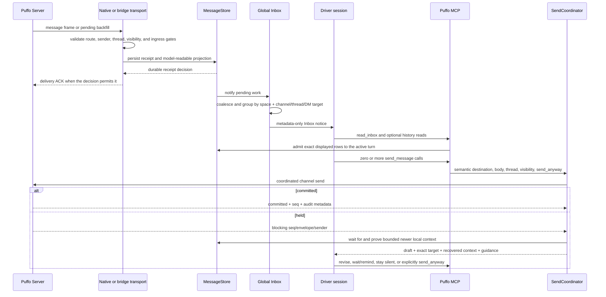

# Puffo Agent Architecture

This is the canonical architecture document for the current `puffo-agent`
tree. It describes implemented behavior. Historical design and review snapshots
under `docs/*-REVIEW.md` and `roadmap/` are evidence for earlier decisions, not
the current runtime contract.

The matching Server control planes landed in
[`puffo-server#251`](https://github.com/puffo-ai/puffo-server/pull/251). The
Agent Foundation work from `puffo-agent#208` is delivered to `main` through the
integration PR `puffo-agent#225`.

## 1. System Model

One daemon reconciles many isolated Agent workers. Every worker uses the same
message, Inbox, turn, send, memory, and reminder layers; only the Puffo
transport and model harness vary.


```mermaid
flowchart LR
    Web[Web and mobile clients] <--> Server[Puffo Server]

    subgraph Host[Agent host or cloud sandbox]
        Daemon[Portal daemon]
        Worker[One worker per Agent]
        Client[PuffoCoreMessageClient facade]
        Store[(messages.db)]
        Inbox[GlobalInboxRuntime]
        Agent[PuffoAgent]
        Runtime[RuntimeManagerAdapter]
        Driver[Codex or Claude Driver]
        MCP[Puffo MCP tools]
        Send[SendCoordinator]

        Daemon --> Worker --> Client
        Client --> Store --> Inbox --> Agent --> Runtime --> Driver
        Driver <--> MCP
        MCP --> Send
    end

    Server <-->|native: signed HTTP and encrypted envelopes| Client
    Server <-->|bridge: sandbox token and plaintext Agent frames| Client
    Send -->|native or keyless coordinated send| Server
```

The two transport modes have different trust boundaries:

| Mode | Agent credential | Where Puffo message crypto runs |
| --- | --- | --- |
| `puffo_core.transport: native` | Per-Agent identity, device, and subkey material under `keys/` | In `puffo-agent`; the Server relays encrypted content. |
| `puffo_core.transport: bridge` | Scoped `sandbox_token`; no local Puffo identity keys | In `puffo-server`; the bridge delivers plaintext to the Agent process. |

Both modes converge before Inbox admission and use the same model-facing
context, Driver, MCP, coordination, memory, and reminder contracts.

## 2. Runtime Ownership

| Owner | Main modules | Responsibility |
| --- | --- | --- |
| Daemon | `portal/daemon.py`, `portal/state.py` | Reconcile desired on-disk Agent state, own process lifecycle, and start loopback/control services. |
| Worker composition root | `portal/worker.py`, `portal/worker_run.py` | Build one Agent's paths, transport, runtime, Inbox, send coordinator, reminder sync, status loop, and cleanup order. |
| Transport facade | `agent/puffo_core_client.py` | Present one receive/send-support surface over native and keyless bridge strategies. |
| Durable message state | `agent/message_store.py`, `agent/inbox_store.py`, `agent/reminder_store.py` | Persist accepted messages, processing state, frontiers, turn membership, notice state, and reminders. |
| Provider boundary | `agent/global_inbox_runtime.py`, `agent/context_controller.py` | Serialize model turns, group pending targets, control context admission, steering, retries, and held recovery. |
| Model runtime | `agent/harness/driver.py`, `agent/harness/runtime_manager.py` | Normalize sessions, turns, streamed events, cancellation, compaction, permissions, and shutdown. |
| Model tools | `mcp/` | Expose Inbox/history, sends, membership, files, memory, reminders, and host integration. |
| Durable control planes | `agent/runtime_event_outbox.py`, `agent/reminder_sync.py` | Upload bounded Runtime events and synchronize encrypted Reminder state with the Server. |

`StandardWorkerRun.run()` is the main non-`ws-local` lifecycle:

```text
prepare paths and managed prompt
  -> prepare Driver or Docker compatibility adapter
  -> construct PuffoAgent and transport client
  -> warm transport and runtime
  -> construct GlobalInboxRuntime + SendCoordinator
  -> start Inbox, Reminder sync, event upload, status, heartbeat, refresh watcher
  -> listen for transport events
  -> stop services and close state in ownership order
```

## 3. Message And Turn Flow

Messages are acknowledged as transport deliveries only after the daemon has
made and persisted an ingress decision. Entering an LLM turn is a separate,
durable state transition.


```mermaid
sequenceDiagram
    participant S as Puffo Server
    participant T as Native or bridge transport
    participant DB as MessageStore
    participant I as Global Inbox
    participant L as Driver session
    participant M as Puffo MCP
    participant C as SendCoordinator

    S->>T: message frame or pending backfill
    T->>T: validate route, sender, thread, visibility, and ingress gates
    T->>DB: persist receipt and model-readable projection
    DB-->>T: durable receipt decision
    T-->>S: delivery ACK when the decision permits it
    DB->>I: notify pending work
    I->>I: coalesce and group by space + channel/thread/DM target
    I->>L: metadata-only Inbox notice
    L->>M: read_inbox and optional history reads
    M->>DB: admit exact displayed rows to the active turn
    L->>M: zero or more send_message calls
    M->>C: semantic destination, body, thread, visibility, send_anyway
    C->>S: coordinated channel send
    alt committed
        S-->>C: committed + seq + audit metadata
    else held
        S-->>C: blocking seq/envelope/sender
        C->>DB: wait for and prove bounded newer local context
        C-->>L: draft + exact target + recovered context + guidance
        L->>M: revise, wait/remind, stay silent, or explicitly send_anyway
    end
```

Important boundaries:

- The transport pushes availability; the model does not poll the Server.
- The Inbox notice is metadata, not a replay of every message. The model reads
  exact pending rows through `read_inbox` and can page or inspect history as
  needed.
- Pending work can span spaces and targets in one provider turn. Each rendered
  message retains its target, Server sequence, timestamp, sender identity/type,
  thread metadata, visibility, and encryption tag.
- One `GlobalInboxRuntime` owns one serial provider boundary per Agent. New
  arrivals can be steered only when the active Driver exposes a safe steering
  capability; otherwise they remain durable for the next turn.
- Plain assistant output is suppressed for Global Inbox turns. Chat output must
  use `send_message`, so routing is explicit and one turn may send to several
  targets.
- `send_anyway` is never an automatic retry. It is an explicit model decision
  after the newer context has crossed the provider admission boundary.
- There is no task-claim subsystem. Coordination is conversation freshness plus
  model reasoning, not exclusive task ownership.

## 4. Freshness And Held Sends

`SendCoordinator` hides transport and freshness bookkeeping from the model.
The public semantic request contains only destination, text or attachments,
thread root, visibility, and optional `send_anyway`.

For channel sends the daemon derives:

- the durable context baseline for the channel;
- the exact Server sequence visible to the active turn;
- the logical draft fingerprint;
- any previously admitted held evidence for that target and turn.

Native Agents call `POST /v2/agent-runtime/messages:send`. Keyless Agents call
`POST /v2/cloud-agents/agent-runtime/messages:send`. The Server serializes Agent
sends per channel and either commits the message or returns `held` with the
blocking boundary. DMs keep their existing send contract and do not use channel
freshness.

A held result is useful only after the Agent has the corresponding decrypted
messages locally. `HeldRecoverySource` waits for transport catch-up, reads a
bounded interval from `MessageStore`, and verifies the terminal sequence and
envelope before returning model-facing context. If that proof cannot be made,
the coordinator fails closed instead of inventing context.

## 5. Driver Contract

`agent/harness/driver.py` is the provider-neutral command/event boundary.

Commands:

```text
open/resume session
start turn
steer active turn
cancel turn
read context status
compact session
resolve permission
close runtime
```

Events normalize runtime/session readiness, turn start/completion, assistant
deltas, tool lifecycle, permission requests, context updates, compaction, and
failures. Provider-native diagnostics stay opaque and are not serialized.

| Runtime kind | Supported harness | Implementation |
| --- | --- | --- |
| `cli-local` | Codex | `CodexAppServerDriver` over `codex app-server`. |
| `cli-local` | Claude Code | `ClaudeCodeCliDriver` over stream-json CLI. |
| `cli-docker` | Claude Code only | Compatibility Adapter in a per-Agent container. |
| `ws-local` | External Agent | Authenticated loopback attachment; no daemon-owned LLM. |

`cli-sandbox` is reserved. Hermes and Gemini remain named design candidates but
are rejected by the current runtime matrix.

## 6. Durable State

Default state is rooted at `~/.puffo-agent/` (overridable with
`PUFFO_AGENT_HOME`).

```text
~/.puffo-agent/
  daemon.yml
  control/
  shared/
  agents/<agent-id>/
    agent.yml
    profile.md
    keys/                    # native transport only
    messages.db              # message, Inbox, turn, and Reminder state
    runtime_events.db        # bounded local Runtime event outbox
    runtime.json             # daemon health/status projection
    memory/
      briefing/
        profile.md
        <topic>.md
      notes/
      recollection/
      imports/
        index.md
    workspace/
      .puffo/inbox/          # materialized inbound attachments
      .puffo-agent/          # current turn and refresh flags
```

The local databases contain model-readable message and Reminder content. File
permissions, per-Agent directory isolation, and atomic writes protect local
state; native wire encryption does not make the already-decrypted local store
ciphertext-only.

Existing Agent configuration is normalized at explicit compatibility
boundaries. Legacy direct-provider runtime names migrate to `cli-local`; old
flat `memory/*.md` files migrate into the memory tree; existing identity,
workspace, message, and session state is retained.

## 7. Memory

The memory tree is implemented end to end:

- `briefing/` is deterministic, bounded, and compiled into managed provider
  prompt artifacts. `briefing/profile.md` receives the managed identity block;
  additional topics are Agent-owned.
- `notes/` holds searchable detail and is not injected by default.
- `recollection/` is maintenance-owned chronological memory.
- `imports/` is importer-owned and read-only to ordinary Agent turns;
  `imports/index.md` records provenance.
- `MemoryStore` validates logical paths, scope, symlink containment, and byte
  budgets, then writes atomically.
- Semantic MCP tools expose notes, briefing topics, recall, imports, and status.
- `memory_git.py` records write history for audit and rollback.

Briefing files are limited to 16 KiB each and the compiled briefing to 64 KiB.
Notes and recollection have separate larger per-file limits. A briefing change
sets a refresh flag; the worker rebuilds managed prompt artifacts and reloads
the provider at a safe lifecycle boundary.

## 8. Runtime Events And Reminders

Local Drivers emit normalized events into `runtime_events.db`. A background
uploader appends bounded, idempotent batches to the Server. The Server provides
session/turn replay and queues cancellation or permission commands; the Agent
acknowledges accepted commands over its active transport.

Reminders are one-shot scheduled occurrences in `messages.db`. The Agent owns
plaintext intent and local firing. It encrypts remote payloads, while the Server
stores opaque content plus scheduling metadata, issues wake hints, and fences
delivery with renewable claims. On restart the Agent reconciles a Server
snapshot before delivering due work. Reminder delivery re-enters the same
Global Inbox as ordinary messages, preserving one provider boundary.

## 9. Control And Local Integration

`portal/control/` links a machine to Puffo operators and applies authenticated
remote create/edit/pause/resume/archive/refresh commands to local desired state.
The daemon reconcile loop remains the lifecycle owner.

Three loopback services support local integration:

| Port | Service | Purpose |
| --- | --- | --- |
| `63385` | RPC | Daemon-mediated host MCP operations. |
| `63386` | Data | Read-only access to per-Agent local data for MCP. |
| `63387` | WS-local | Authenticated attachment for an external Agent brain. |

## 10. Current Limits

- The frontend is outside this repository. Runtime events are exposed for Web
  and mobile clients, but this PR does not implement their UI.
- Keyless outbound DM allowlisting is incomplete: the bridge Agent cannot yet
  perform the signed allowlist write used by the native self-echo path.
- Reactions are not a Puffo message feature in this release.
- Docker Codex, Hermes, Gemini, and `cli-sandbox` are not supported runtime
  combinations.
- Sequence-less receipt handling remains as a compatibility/local-event lane;
  current Server bridge message frames carry an authoritative positive `seq`.

## 11. Change Map

Use these entry points when tracing a change:

| Concern | Start here |
| --- | --- |
| Daemon lifecycle | `portal/daemon.py`, `portal/worker_run.py` |
| Runtime selection | `portal/runtime_matrix.py`, `agent/harness/local_runtime.py` |
| Driver protocol | `agent/harness/driver.py`, `agent/harness/runtime_manager.py` |
| Native/bridge receive | `agent/puffo_core_client.py`, `agent/inbound_receipts.py`, `agent/bridge_transport.py` |
| Durable Inbox | `agent/message_store.py`, `agent/inbox_store.py`, `agent/global_inbox_runtime.py` |
| Context rendering | `agent/message_projection.py`, `agent/context_controller.py` |
| Coordinated send | `agent/send_coordinator.py`, `agent/global_inbox_send.py`, `agent/global_inbox_held.py` |
| Model tools | `mcp/puffo_core_server.py`, `mcp/core_*_tools.py` |
| Memory | `agent/memory.py`, `agent/memory_store.py`, `mcp/memory_tools.py` |
| Reminders | `agent/reminder_store.py`, `agent/reminder_scheduler.py`, `agent/reminder_sync.py` |
| Runtime events | `agent/runtime_event_outbox.py`, `agent/runtime_events.py` |
| External Agent attachment | `portal/ws_local/` |

## 12. Invariants

1. Inbound content is durably classified before transport acknowledgement.
2. Only rows explicitly admitted across a provider boundary advance active-turn
   visibility.
3. Global Inbox turns serialize per Agent; target identity remains explicit.
4. Freshness metadata is daemon-owned and never model-authored.
5. A held send has no message, delivery, notification, or freshness side
   effect on the Server.
6. `send_anyway` is explicit and evidence-bound, never automatic.
7. Provider-specific behavior terminates at the Driver/Adapter boundary.
8. Native and keyless transports converge before model-facing projection.
9. Memory writes stay inside validated logical scopes and preserve audit history.
10. Reminder wake-up is a hint; durable state and fenced claims decide delivery.
