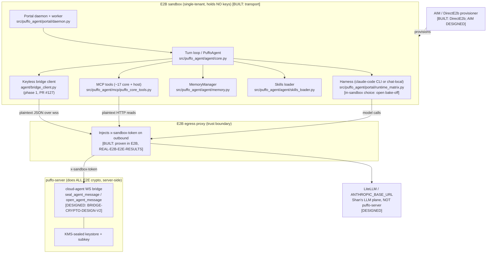
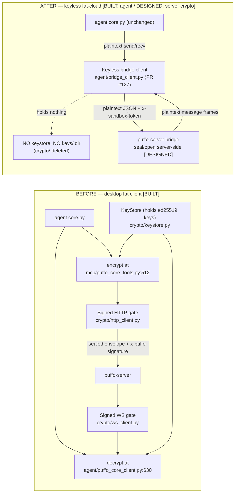
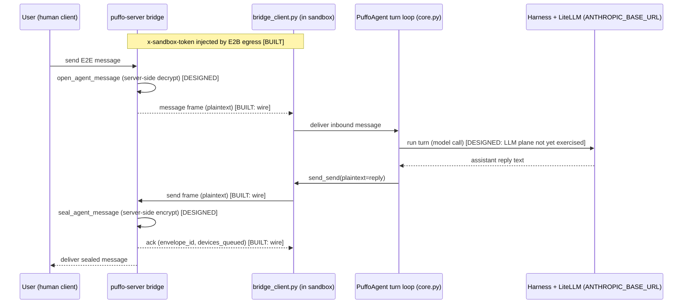
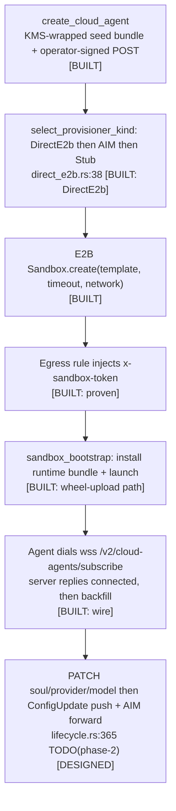

# FAT CLOUD Agent Architecture

> **What this documents.** The **FAT CLOUD agent** = the same fat Python agent that
> ships today in `src/puffo_agent/` (the desktop agent), run **inside an E2B
> sandbox** with exactly one thing swapped: its message transport moves from the
> client-held-key HTTP/WS crypto path to a **keyless WebSocket bridge** where the
> server does all end-to-end crypto and egress auth rides an `x-sandbox-token`
> header injected by E2B. Everything *above* the transport seam — the turn loop,
> the MCP tool surface, memory, skills, the portal daemon/worker — is unchanged.
>
> **This is a forward design.** Phase 1 (the keyless transport seam in the fat
> agent) is built; phases 2–4 are designed. The organizing discipline of this doc
> is **built-vs-designed honesty**: nothing that is only designed is drawn as
> built. Every claim below carries one of the labels in the legend.

---

## Label legend (read this first)

| Label | Meaning |
|-------|---------|
| **[BUILT]** | Merged code you can run today. In-repo citations are `src/puffo_agent/...` in *this* worktree; phase-1 code is on the sibling branch `fleet/fat-cloud-phase1` (PR #127) and is cited as such. |
| **[DESIGNED]** | Specified in a design/roadmap doc or a server-side `TODO(phase-*)`, but **not merged**. Named honestly; never drawn as working. |
| **[BLOCKED-ON-NEW-SERVER-FRAME]** | Needs a new `puffo-server` bridge WS frame (and often a new product feature) that does not exist yet. A strict subset of DESIGNED, called out because these are gated on the server, not on the agent. |

**Citation conventions (so nothing cross-repo is mistaken for a local path):**

- `src/puffo_agent/...py` — a path in **this** worktree (`puffo-agent`, branch
  `fleet/fatcloud-arch-doc`). These are the only real, grep-checkable local paths.
- `puffo-agent @ fleet/fat-cloud-phase1 (PR #127)` — phase-1 code on the sibling
  branch. Referenced by short name (e.g. `agent/bridge_client.py`), **never** with
  a `src/puffo_agent/` prefix, because that file does **not** exist in this worktree.
- `puffo-server roadmap/cloud-agent/<DOC>.md` — a design doc in the **puffo-server**
  monorepo (a *different* repo). Never a local path.
- `puffo-server server/src/cloud_agent/*.rs @ fleet/<branch>` — server Rust, cross-repo.

---

## Overview / TL;DR

The desktop `puffo-agent` is a **fat client**: it holds its own ed25519 keys,
signs every request, and seals/opens every message locally
(`src/puffo_agent/crypto/http_client.py`, `src/puffo_agent/crypto/ws_client.py`,
`src/puffo_agent/crypto/keystore.py`). The fat-cloud agent is the **same binary**
minus that key custody. It runs inside a single-tenant E2B sandbox that holds
**no key material**; it talks **plaintext JSON frames** to the puffo-server
cloud-agent bridge, and the **server** performs all E2E seal/open on its behalf
(`puffo-server roadmap/cloud-agent/BRIDGE-WIRE-PROTOCOL.md`, `BRIDGE-CRYPTO-DESIGN-V2.md`).

Three sentences, three buckets:

- **KEEP** — the whole cognitive stack. Turn loop, adapters/harness selection, the
  ~17 puffo-core MCP tools + host tools, the memory manager, the skills loader, and
  the portal daemon/worker lifecycle are byte-for-byte the desktop code. **[BUILT]**
- **SWAP** — the transport/crypto seam. Delete the client-held-key `crypto/` package
  and the runtime `keys/` directory; select `puffo_core.transport: "bridge"` in
  `agent.yml`; the encrypt/decrypt call sites become plaintext bridge send/recv.
  **[BUILT — phase 1, PR #127]** for the agent side; server-side seal/open crypto is
  **[DESIGNED]**.
- **ADD** — the cloud-only surface. Live config (create-with-config + `PATCH` +
  `ConfigUpdate` push), server→AIM forward, and the message features still missing
  from the bridge (backfill, read-ack, threads, attachments, reactions). Mostly
  **[DESIGNED]** / **[BLOCKED-ON-NEW-SERVER-FRAME]**.

### Fat-cloud container diagram



---

## What fat-cloud KEEPS

Everything above the transport seam is the **desktop agent, unmodified** — this is
the entire value of the "fat" approach: one cognitive codebase, two transports.
All six nails are **[BUILT]** and cited into this worktree.

1. **The turn loop.** `PuffoAgent` (`src/puffo_agent/agent/core.py:71`) owns the
   per-turn loop and delegates each turn to an `Adapter`
   (`src/puffo_agent/agent/core.py:82`). The sandbox runs this identical loop; it
   never learns it is "in the cloud" — it just gets messages from a different
   transport.

2. **Adapters / harness selection.** Which harness actually runs the model is
   resolved by the `(runtime, provider, harness)` validity matrix
   (`src/puffo_agent/portal/runtime_matrix.py`): `claude-code`, `hermes`,
   `gemini-cli`, `codex`, keyed to providers, with a default per provider
   (`DEFAULT_HARNESS_FOR_PROVIDER`, `src/puffo_agent/portal/runtime_matrix.py:105`).
   In-sandbox this machinery is unchanged; *which* harness is preferred inside E2B
   (the `claude-code` CLI vs. the `chat-local` in-process path) is an **open
   bake-off** — see "The in-sandbox think-path".

3. **The MCP tool surface.** The ~17 puffo-core message tools are registered by
   `register_core_tools` (`src/puffo_agent/mcp/puffo_core_tools.py:368`, `@mcp.tool`
   ×17) and served through `src/puffo_agent/mcp/puffo_core_server.py`; host/system
   tools live in `src/puffo_agent/mcp/host_tools.py` and
   `src/puffo_agent/mcp/_host_mcp.py`. The tool *contracts* are unchanged; only the
   handful that reach puffo-server change **how** they authenticate (see SWAP/ADD).

4. **Memory.** `MemoryManager` (`src/puffo_agent/agent/memory.py:6`) loads per-topic
   markdown from a memory directory and injects it as context. The cloud agent keeps
   this verbatim. (The "M1–M4" memory *milestones* are separate roadmap work on
   sibling branches `agent-memory-m1…m4`; they are **not** literal tiers in
   `memory.py` today, and this doc does not claim otherwise.)

5. **Skills.** The skills loader (`src/puffo_agent/agent/skills_loader.py`) and the
   repo `skills/` dir are unchanged; skills are baked into the E2B template alongside
   the runtime.

6. **Portal daemon/worker lifecycle.** The daemon
   (`src/puffo_agent/portal/daemon.py`), the per-agent worker
   (`src/puffo_agent/portal/worker.py`), and the RPC service
   (`src/puffo_agent/portal/rpc_service.py`) supervise the agent the same way in a
   sandbox as on a desktop — one worker per agent, respawn on crash, reconcile from
   `agent.yml`.

---

## What fat-cloud SWAPS

Exactly one seam changes: the message **transport and its crypto**. Desktop holds
keys and does crypto locally; fat-cloud holds nothing and lets the server do it.

### The desktop "BEFORE" side (all [BUILT], in this worktree)

- **Signed HTTP gate** — `PuffoCoreHttpClient` subkey-signs every request
  (`src/puffo_agent/crypto/http_client.py`; per the token-auth audit, `sign_request`
  at `crypto/http_auth.py`).
- **Signed WS gate** — the client-crypto WebSocket path
  (`src/puffo_agent/crypto/ws_client.py`).
- **Local keystore** — `KeyStore` reads/writes ed25519 identity + session key files
  under `~/.puffo-agent/agents/<id>/keys` (`src/puffo_agent/crypto/keystore.py:86`).
- **Decrypt call site** — inbound envelopes are opened locally by `decrypt_message`
  at `src/puffo_agent/agent/puffo_core_client.py:630`.
- **Encrypt call site** — outbound messages are sealed locally by
  `encrypt_message_with_content_key` at `src/puffo_agent/mcp/puffo_core_tools.py:512`.

### The keyless "AFTER" side (agent side [BUILT] phase 1 / PR #127; server crypto [DESIGNED])

- **Selected by config, not by fork.** An agent opts in with
  `puffo_core.transport: "bridge"` in its `agent.yml` (validated in
  `portal/state.py`: `VALID_TRANSPORTS = ("native", "bridge")`, and `bridge`
  requires both `server_url` and `sandbox_token`). The worker picks the transport at
  `portal/worker.py:363` (`if pc.transport == "bridge": CloudBridgeClient(...)`).
  The default `"native"` transport keeps today's signed-crypto path and never imports
  the bridge. *(All three — `agent/bridge_client.py`, `portal/state.py` transport
  keys, `portal/worker.py:363` — are on `puffo-agent @ fleet/fat-cloud-phase1`,
  PR #127; they are **not** in this worktree.)*
- **`crypto/` deleted; `keys/` gone.** In the bridge transport the whole
  client-held-key `crypto/` package (14 modules, ~1,578 LOC in this worktree) is
  removed and the runtime `keys/` directory is never written — the sandbox holds no
  key material. `agent/bridge_client.py` (phase 1, ~290 LOC) **deliberately imports
  nothing from `crypto/`**.
- **Call sites become plaintext send/recv.** The local seal at
  `mcp/puffo_core_tools.py:512` and open at `agent/puffo_core_client.py:630` are
  replaced by `bridge_client.send_send(plaintext=…)` and iterating
  `bridge_client.frames()` — the server seals/opens on the wire
  (`puffo-server roadmap/cloud-agent/BRIDGE-WIRE-PROTOCOL.md` §3.2, §4.4).
- **Server-side crypto is [DESIGNED].** The server functions that make the swap
  actually deliver — `seal_agent_message` (outbound) and `open_agent_message`
  (inbound) across the `puffo_crypto::server_api` boundary, plus the R11 subkey-seed
  glue — are specified but **not merged**
  (`puffo-server roadmap/cloud-agent/BRIDGE-CRYPTO-DESIGN-V2.md` Part 1). Until they
  land, a fat-cloud agent connects and receives, but a `send` returns
  `error{code:"NO_SUBKEY"}`.

> **Swap magnitude, honestly.** The task brief cited a specific "+230 / −2070" line
> delta; that figure does **not** appear in any design doc I could read, so this doc
> does **not** repeat it. The observable magnitude in the tree is: delete the 14-file
> / ~1,578-LOC `crypto/` package + runtime `keys/`, add the ~290-LOC keyless
> `agent/bridge_client.py`. Net: a large deletion, a small addition — the exact
> spirit of the cited figure, quantified from what actually exists.

### Transport-seam BEFORE → AFTER



---

## What fat-cloud must ADD

These surfaces exist only for the cloud shape. None are drawn as built beyond what
is cited.

- **A1 — live config surface.** Create-with-config and a `PATCH` that edits the
  mutable subset (`soul` / `provider` / `model`) exist on the config-crud branch:
  `PatchCloudAgentRequest` and `patch_cloud_agent`
  (`puffo-server server/src/cloud_agent/lifecycle.rs:152, :339 @ fleet/cloud-agent-config-crud`).
  What is **[DESIGNED]**, not built, is pushing those edits live to a running agent
  and forwarding them onward — the code itself says so:
  `// TODO(phase-2): notify runtime via AgentServerMsg::ConfigUpdate + forward provider/model/soul to AIM`
  (`lifecycle.rs:365`). So: **`ConfigUpdate` WS push = [DESIGNED]**; the server→AIM
  forward of provider/model/soul = **[DESIGNED]**.
- **Metadata reads over token-HTTP.** Four membership-scoped read routes
  (`GET /spaces`, `GET /spaces/{id}/channels`, `.../members`, `GET /identities/profiles`)
  need to accept the `x-sandbox-token` as an alternative to subkey-signing so a
  keyless agent can call them; the mechanism (a `SubkeyOrTokenAuth` extractor reusing
  `resolve_agent_by_token`) is specified but not merged
  (`puffo-server roadmap/cloud-agent/MCP-TOKEN-AUTH-AUDIT.md` §3). **[DESIGNED]**
- **Message features still missing from the bridge:**
  - **Backfill / history** (`fetch_pending` frame) and **read-ack** (`ack` frame) —
    the two priority gaps in `BRIDGE-COVERAGE-AUDIT.md` §6 (#1/#2). The phase-1 client
    already implements `send_fetch_pending` / `send_ack`
    (`agent/bridge_client.py`), but the authoritative gap audit lists the server side
    as not-yet-covered. **[DESIGNED]**
  - **Threads / `root_id`** — the `send` frame carries no `root_id`, so threaded
    replies need a new frame field. **[BLOCKED-ON-NEW-SERVER-FRAME]**
  - **Attachments / blob** — no upload/download bridge frames exist. **[BLOCKED-ON-NEW-SERVER-FRAME]**
  - **Reactions** — absent server-wide; needs core + server + a new bridge frame
    (`BRIDGE-COVERAGE-AUDIT.md` §6.4). **[BLOCKED-ON-NEW-SERVER-FRAME]**

---

## The in-sandbox think-path

Inside the sandbox the agent thinks exactly as on desktop — same turn loop, same
harness machinery (`src/puffo_agent/portal/runtime_matrix.py`) — with two cloud-only
substitutions on the **model** plane (not the message plane):

1. **Harness choice is an open bake-off.** The runtime matrix supports both the
   `claude-code` CLI harness and the in-process `chat-local` path. Which one runs
   *inside E2B* is undecided; the desktop default resolution
   (`DEFAULT_HARNESS_FOR_PROVIDER`, `runtime_matrix.py:105`) is the starting point,
   but the sandbox trade-off (CLI process overhead vs. in-process simplicity) is
   still being evaluated. **[DESIGNED]** for the cloud default.
2. **`ANTHROPIC_BASE_URL` → LiteLLM.** In the sandbox, model calls are pointed at a
   **LiteLLM** virtual-key endpoint via `ANTHROPIC_BASE_URL` env, which retires the
   old `/v1/llm/complete` server route. Crucially, this LLM plane is **Shan's
   LiteLLM, not puffo-server** — and it was **not exercised** in the proven E2B run:
   "The agent autonomously thinking/sending a chat message needs the LLM plane
   (`/v1/llm/complete` = Shan's litellm, not puffo-server)… not exercised"
   (`puffo-server roadmap/cloud-agent/REAL-E2B-E2E-RESULTS.md`). So the message
   round-trip (connect → backfill → receive) is proven; the **think-then-send**
   round-trip is **[DESIGNED]**.

### Message + think-path round trip (in-sandbox)



---

## Trust boundary

The desktop and fat-cloud agents sit on **opposite sides** of the key-custody line.

- **Desktop:** the agent **is** the trust root. It holds ed25519 identity + subkey
  material (`src/puffo_agent/crypto/keystore.py`), signs each request
  (`src/puffo_agent/crypto/http_client.py`), and seals/opens every message locally
  (`mcp/puffo_core_tools.py:512`, `agent/puffo_core_client.py:630`). Compromise the
  desktop process → you have the keys.
- **Fat-cloud:** the sandbox **holds nothing.** No keystore, no signing key, no
  subkey, no envelope crypto (`agent/bridge_client.py` imports nothing from
  `crypto/`). Two mechanisms replace client custody:
  1. **`x-sandbox-token` egress injection.** The sandbox never sets the auth header
     itself; **E2B's egress proxy injects `x-sandbox-token`** on outbound requests to
     the puffo host. The server only ever *reads* it
     (`puffo-server roadmap/cloud-agent/BRIDGE-WIRE-PROTOCOL.md` §2.2). This was
     **proven end-to-end** in a real (billed, then destroyed) sandbox: a plain
     `curl` from inside the sandbox — setting no header — got `GET /spaces → 200`
     because E2B injected the token
     (`puffo-server roadmap/cloud-agent/REAL-E2B-E2E-RESULTS.md`). **[BUILT]**
  2. **Server-side E2E crypto.** All seal/open runs in `puffo-server`'s bridge module
     against KMS-sealed key material; key bytes and plaintext never appear in a WS
     frame or a log line
     (`puffo-server roadmap/cloud-agent/BRIDGE-WIRE-PROTOCOL.md` §1). **[DESIGNED]**
     (the seal/open core functions are not yet merged).
- **Scope is structural.** `resolve_agent_by_token` yields exactly the agent's own
  slug with revocation/expiry enforced in SQL, so a token grants the agent's own
  memberships and nothing broader
  (`puffo-server roadmap/cloud-agent/MCP-TOKEN-AUTH-AUDIT.md` §3c). **[DESIGNED]**
  for the HTTP path; already true for the WS path.

---

## Deployment (E2B / provisioning)

- **One sandbox, one agent.** The server keeps an `agent_slug → connection` map and
  registers on connect / unregisters on disconnect; there is exactly one live bridge
  connection per agent (`BRIDGE-WIRE-PROTOCOL.md` §5.5). **[BUILT: wire]**
- **Baked E2B template.** The agent runtime (fat `puffo_agent` + skills) is baked
  into an E2B template so the sandbox boots ready to connect. The proven run used a
  wheel-upload onto a base template as a fallback to a fully baked one
  (`REAL-E2B-E2E-RESULTS.md`). **[BUILT: proven chain]**
- **Provisioning path: DirectE2b or AIM.** `puffo-server` has three sandbox
  provisioners with a fixed boot order **DirectE2b → AIM → Stub**
  (`select_provisioner_kind`,
  `puffo-server server/src/cloud_agent/direct_e2b.rs:38 @ fleet/cloud-agent-config-crud`).
  `DirectE2bProvisioner` (opt-in `E2B_DIRECT=1`) creates a real E2B sandbox and
  injects the per-host `x-sandbox-token` egress rule — **proven** in the real run
  (`REAL-E2B-E2E-RESULTS.md`: "DirectE2bProvisioner (#155) really creates an E2B
  sandbox + injects the token"). **[BUILT]** The `AimHttpProvisioner` path (provision
  via AIM) plus the create→ConfigUpdate live-config loop are **[DESIGNED]**.

### Provisioning / lifecycle



---

## Phase status (1..4)

| Phase | What it delivers | Status | Blocking dependency |
|-------|------------------|--------|---------------------|
| **Phase 1** | Keyless bridge transport in the fat agent: `agent/bridge_client.py`, `agent.yml` `transport: bridge` + `sandbox_token`, worker transport selection. | **[BUILT]** — `puffo-agent @ fleet/fat-cloud-phase1`, **PR #127** | none (merged on that branch) |
| **Phase 2** | Live config: `create-with-config` + `PATCH` wired to a `ConfigUpdate` WS push and a server→AIM forward of `soul`/`provider`/`model`. | **[DESIGNED]** | `AgentServerMsg::ConfigUpdate` frame + AIM forward (`lifecycle.rs:365 TODO(phase-2)`) |
| **Phase 3** | Bridge message-surface completion: `fetch_pending` backfill + `ack` read-state, `list_spaces`/`spaces`, token-HTTP metadata reads. | **[DESIGNED]** | new/confirmed server frames (`BRIDGE-COVERAGE-AUDIT.md` §6 #1/#2; `MCP-TOKEN-AUTH-AUDIT.md` §3) |
| **Phase 4** | Rich message features: threads/`root_id`, attachments/blob, reactions. | **[DESIGNED]** / **[BLOCKED-ON-NEW-SERVER-FRAME]** | new bridge frames + (for reactions) a new product feature in core + server |

The one honest through-line: **only phase 1 is built.** The proven E2B chain
(create → sandbox → WS connect → MCP read → backfill) used the *thin* runtime and
validated the keyless posture; the fat agent's server-side seal/open and the LLM
plane are still designed.

---

## Delta-from-desktop table

Every capability row from `puffo-server roadmap/cloud-agent/BRIDGE-COVERAGE-AUDIT.md`
§3 is represented, so the table is complete against the gap audit. Disposition is
one of `keep` / `swap` / `add` / `drop-by-design`.

| Capability | Desktop | Fat-cloud (keep / swap / add / drop-by-design) | Status |
|------------|---------|-----------------------------------------------|--------|
| Turn loop / adapters / harness | Local `PuffoAgent` (`agent/core.py`) + runtime matrix | **keep** — unchanged | [BUILT] |
| MCP tool surface (~17 core + host) | `register_core_tools` (`mcp/puffo_core_tools.py`) | **keep** — same contracts | [BUILT] |
| Memory / skills | `MemoryManager` (`agent/memory.py`), skills loader | **keep** — unchanged | [BUILT] |
| Portal daemon/worker lifecycle | `portal/daemon.py`, `portal/worker.py` | **keep** — one worker per agent | [BUILT] |
| Key custody | Local `KeyStore` ed25519 keys (`crypto/keystore.py`) | **swap** — sandbox holds nothing; server-side keystore | [BUILT: agent] |
| Send DM | Local seal + `POST /messages` (`mcp/puffo_core_tools.py:512`) | **swap** — plaintext `send{recipient_slug}` frame | [BUILT: wire] / [DESIGNED: server seal] |
| Send channel message | Local seal + `POST /messages` | **swap** — plaintext `send{space_id,channel_id}` frame | [BUILT: wire] / [DESIGNED: server seal] |
| Receive message (live push) | Local decrypt (`agent/puffo_core_client.py:630`) | **swap** — server decrypts, pushes plaintext `message` frame | [BUILT: wire] / [DESIGNED: server open] |
| Send-ack (server→agent) | HTTP 200 | **swap** — `ack` frame (`envelope_id`, `devices_queued`) | [BUILT: wire] |
| Presence / liveness | Signed WS keepalive (`crypto/ws_client.py`) | **swap** — `heartbeat` frame + server `ping` | [BUILT] |
| Fetch pending / backfill / history | `GET /messages/pending` (local decrypt) | **add** — `fetch_pending` frame (client method in phase 1) | [DESIGNED] |
| Ack / mark received read | `POST /messages/ack` | **add** — `ack{envelope_ids}` frame | [DESIGNED] |
| Metadata reads (spaces/channels/members/profiles) | Subkey-signed `GET /spaces…` | **add** — token-HTTP (`SubkeyOrTokenAuth`) | [DESIGNED] |
| Live config (soul/provider/model) | n/a (edit local `agent.yml`) | **add** — `PATCH` + `ConfigUpdate` push + AIM forward | [DESIGNED] (`lifecycle.rs:365`) |
| Threads / `root_id` | n/a on bridge | **add** — needs `root_id` on the `send` frame | [BLOCKED-ON-NEW-SERVER-FRAME] |
| Attachments — upload/download | `POST /blobs/upload` / `GET /blobs/{id}` (client-encrypted) | **add** — needs blob bridge frames | [BLOCKED-ON-NEW-SERVER-FRAME] |
| Reactions | none (absent server-wide) | **add** — needs core + server + bridge frame | [BLOCKED-ON-NEW-SERVER-FRAME] |
| Space/channel metadata edit/delete | `PATCH`/`DELETE /spaces…` | **drop-by-design** — out of an agent's lane | — (drop-by-design) |
| Message edit / delete / unsend | none (absent server-wide) | **drop-by-design** — no product feature | — (drop-by-design) |
| Typing indicator / read receipt | none (absent server-wide) | **drop-by-design** — ephemeral, no product feature | — (drop-by-design) |
| Identity/device/subkey rotation over the wire | Local key ops | **drop-by-design** — deliberate trust-tier exclusion | — (drop-by-design) |

---

## Self-audit (built-vs-designed honesty check)

The author ran this checklist against the finished doc:

- [x] **(i) Every Mermaid block parses.** All four blocks open with a valid diagram
      keyword (`flowchart` ×3, `sequenceDiagram` ×1); no `C4Context`; opening
      ```` ```mermaid ```` fences balance their closing fences.
- [x] **(ii) ≥10 in-worktree citations resolve.** ≥15 distinct `src/puffo_agent/…py`
      paths are cited and every one exists in this worktree (`crypto/http_client.py`,
      `crypto/ws_client.py`, `crypto/keystore.py`, `agent/puffo_core_client.py`,
      `mcp/puffo_core_tools.py`, `agent/core.py`, `portal/runtime_matrix.py`,
      `agent/memory.py`, `agent/skills_loader.py`, `portal/daemon.py`,
      `portal/worker.py`, `portal/rpc_service.py`, `mcp/host_tools.py`,
      `mcp/puffo_core_server.py`, `mcp/_host_mcp.py`).
- [x] **(iii) KEEP / SWAP / ADD + delta table complete vs. the coverage audit.** All
      six KEEP nails, the full SWAP seam (`crypto/` deleted + `keys/` gone +
      `agent.yml` bridge/sandbox_token), and every ADD item are present; the delta
      table represents every capability row of `BRIDGE-COVERAGE-AUDIT.md` §3.
- [x] **(iv) No designed-only item is presented as merged code.**
      Each of `ConfigUpdate`, threads/`root_id`, attachments, and reactions appears
      only with a `[DESIGNED]` or `[BLOCKED-ON-NEW-SERVER-FRAME]` label.
      Conversely, every `[BUILT]` claim traces to phase-1 code
      (PR #127 / `fleet/fat-cloud-phase1`), to the proven E2B chain, or to code in
      `src/puffo_agent/` in this worktree.
- [x] **(v) Cross-repo/branch citations are qualified.** `bridge_client.py`, the
      `BRIDGE-*` / `MCP-TOKEN-AUTH-AUDIT` docs, and `server/src/cloud_agent/*.rs` are
      each labeled with their repo/branch; `bridge_client.py` is only ever referenced
      by its short name (never with a local `src/puffo_agent/` prefix), because that
      file lives on `fleet/fat-cloud-phase1` and is not in this worktree.
- [x] **(vi) Honest omission.** The task-cited "+230/−2070" swap figure was not found
      in any readable design doc and is **not** repeated; the swap magnitude is
      quantified from the tree instead.
