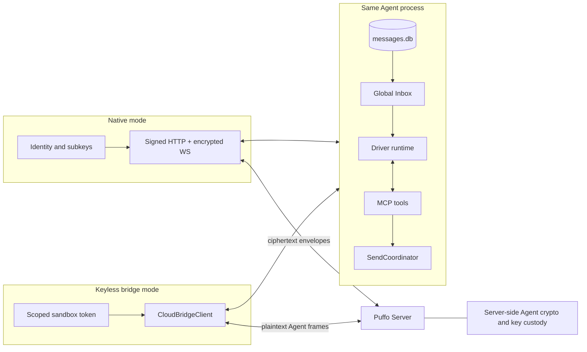
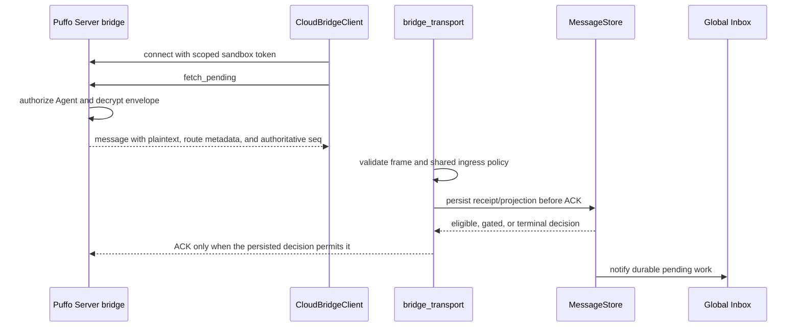
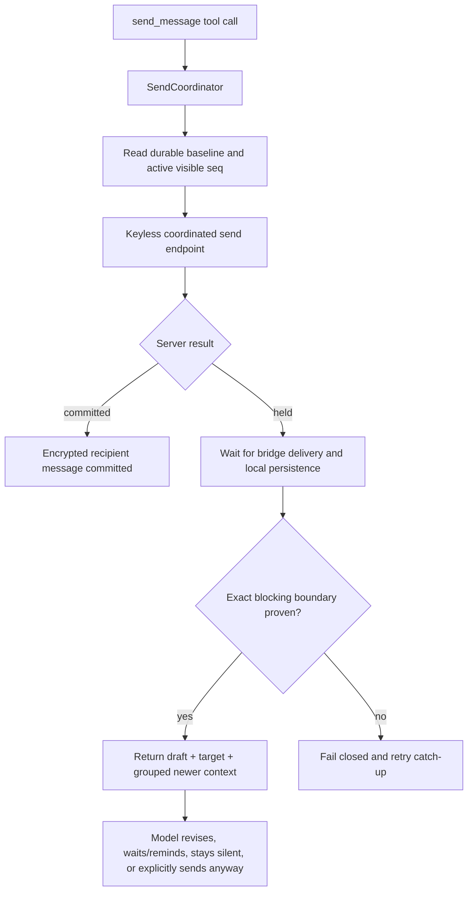

# Keyless Fat-Cloud Architecture

This document describes the implemented cloud-specific delta in the current
`puffo-agent` tree. The complete Agent architecture is
[`ARCHITECTURE.md`](ARCHITECTURE.md).

Earlier phase plans under `roadmap/cloud-agent/` and the companion review file
capture historical decisions. They are not a status source for the current
integration branch.

## 1. One Agent, Two Puffo Transports

"Fat cloud" means the cloud sandbox runs the same Agent cognition stack as a
local installation: durable Inbox, context admission, Codex/Claude runtime,
MCP tools, memory, reminders, and Runtime events. It does not use a thin remote
completion loop.

Only the Puffo transport and key-custody boundary change.


```mermaid
flowchart LR
    subgraph Shared[Same Agent process]
        Store[(messages.db)]
        Inbox[Global Inbox]
        Runtime[Driver runtime]
        MCP[MCP tools]
        Send[SendCoordinator]
        Store --> Inbox --> Runtime <--> MCP --> Send
    end

    subgraph Native[Native mode]
        Keys[Identity and subkeys]
        NativeClient[Signed HTTP + encrypted WS]
        Keys --> NativeClient
    end

    subgraph Cloud[Keyless bridge mode]
        Token[Scoped sandbox token]
        Bridge[CloudBridgeClient]
        Token --> Bridge
    end

    Server[Puffo Server]
    NativeClient <--> Shared
    Bridge <--> Shared
    NativeClient <-->|ciphertext envelopes| Server
    Bridge <-->|plaintext Agent frames| Server
    Server --- Crypto[Server-side Agent crypto and key custody]
```

The bridge is a transport strategy, not a second Agent implementation.
`PuffoCoreMessageClient` normalizes both paths into the same persisted message and
model-facing projection.

## 2. Trust Boundary

| Property | Native | Keyless cloud bridge |
| --- | --- | --- |
| Local credential | Agent identity, device, subkeys | Scoped `sandbox_token` |
| Puffo envelope encryption/decryption | Agent process | Puffo Server |
| Bridge payload visible to Agent | Decrypted after local crypto | Plaintext from the Server bridge |
| Puffo keys in runtime | Yes, under the Agent `keys/` directory | No |
| Server authorization | Signed Agent identity/subkey | Token resolved to one Agent scope |
| Coordinated send endpoint | `/v2/agent-runtime/messages:send` | `/v2/cloud-agents/agent-runtime/messages:send` |

Keyless does not mean plaintext leaves the Puffo trust boundary without
authentication. It means the cloud Agent delegates Puffo message crypto to the
Server and authenticates as one scoped Agent with a sandbox token. Plaintext is
present inside both the Server crypto boundary and the sandbox Agent process.

The LLM provider credential is a separate concern. A sandbox can use a CLI
login or a provisioned model gateway credential; neither changes Puffo message
authorization.

## 3. Configuration And Construction

The per-Agent `agent.yml` selects the bridge:

```yaml
puffo_core:
  server_url: https://example.puffo.ai
  slug: agent-handle
  device_id: cloud-runtime
  space_id: initial-space
  transport: bridge
  sandbox_token: <scoped token>
```

`portal/state.py` validates that bridge mode has both `server_url` and
`sandbox_token`. The worker construction path creates `CloudBridgeClient`
instead of the native signed HTTP/WebSocket pair. No runtime `keys/` material is
required for bridge message transport.

After construction the same `StandardWorkerRun` builds:

- `MessageStore` and Global Inbox;
- `PuffoAgent` and the chosen Driver/Adapter;
- `SendCoordinator` with the keyless HTTP transport;
- status, Runtime event, and Reminder synchronization loops;
- managed prompts, memory, skills, and workspace paths.

Cloud sandbox provisioning and lifecycle ownership live in `puffo-server`/AIM,
not in this repository. This package owns the process after its files and token
have been provisioned.

## 4. Receive Path


```mermaid
sequenceDiagram
    participant S as Puffo Server bridge
    participant B as CloudBridgeClient
    participant P as bridge_transport
    participant DB as MessageStore
    participant I as Global Inbox

    B->>S: connect with scoped sandbox token
    B->>S: fetch_pending
    S->>S: authorize Agent and decrypt envelope
    S-->>B: message with plaintext, route metadata, and authoritative seq
    P->>P: validate frame and shared ingress policy
    P->>DB: persist receipt/projection before ACK
    DB-->>P: eligible, gated, or terminal decision
    P-->>S: ACK only when the persisted decision permits it
    DB->>I: notify durable pending work
```

The current Server bridge message includes an authoritative positive `seq`.
The Agent rejects malformed sequence values and stores sequenced messages in
the same Server-frontier lane as native transport. A sequence-less lane remains
for older bridge senders and daemon-local events; it uses a local monotonic
ordinal and never fabricates a Server freshness boundary.

Native and bridge ingress share the same policy order and projection rules for
blocked senders, self echoes, operator control, foreign DMs, stale catch-up,
threads, visibility, sender attribution, and attachments. Transport-specific
code only maps the shared decision to its ACK and persistence mechanics.

## 5. Send And Held Recovery

Model-facing `send_message` arguments do not include tokens, Server sequences,
context baselines, or envelope construction. `SendCoordinator` derives those
facts from daemon-owned state.

For keyless channel sends it posts plaintext semantic content plus the derived
freshness boundary to the Server's keyless coordinated endpoint. The Server
encrypts committed output for recipients. If a newer Agent message blocks the
draft, it returns the same `held` metadata contract used by native Agents.


```mermaid
flowchart TD
    Tool[send_message tool call] --> Coordinator[SendCoordinator]
    Coordinator --> Boundary[Read durable baseline and active visible seq]
    Boundary --> Endpoint[Keyless coordinated send endpoint]
    Endpoint --> Decision{Server result}
    Decision -->|committed| Stored[Encrypted recipient message committed]
    Decision -->|held| Catchup[Wait for bridge delivery and local persistence]
    Catchup --> Proof{Exact blocking boundary proven?}
    Proof -->|yes| Context[Return draft + target + grouped newer context]
    Proof -->|no| Closed[Fail closed and retry catch-up]
    Context --> Model[Model revises, waits/reminds, stays silent, or explicitly sends anyway]
```

The held response itself contains metadata, not decrypted conversation text.
The Agent obtains readable context from its local store after bridge catch-up.

## 6. Implemented Bridge Surface

| Capability | Current implementation |
| --- | --- |
| Connect/reconnect and heartbeat | Bridge WebSocket with scoped token. |
| Pending recovery and ACK | `fetch_pending`, bounded drain, persisted-decision ACK. |
| Message sequence | Authoritative Server `seq`, with sequence-less compatibility fallback. |
| Channels, DMs, and threads | Canonical route, thread root/reply, sender, visibility, and content fields. |
| Attachments | Token-authenticated blob upload/download and local materialization. |
| Directory metadata | Bridge/token-backed space and channel data used by MCP and caches. |
| Status | Runtime status frames over the bridge. |
| Runtime commands | Authenticated command frames routed to the Driver command executor. |
| Coordinated channel sends | Keyless Agent Runtime endpoint with `held` and explicit `send_anyway`. |
| Runtime events | Keyless append transport using the shared local outbox. |
| Reminders | Encrypted remote snapshots, wake hints, and delivery claims over keyless routes. |

## 7. What Is Shared

These components do not branch on native versus keyless policy:

- `GlobalInboxRuntime`, grouping, notice delivery, and context admission;
- model-facing message projection and history formatting;
- Codex/Claude Driver contract and Runtime Manager;
- MCP tool names and semantic arguments;
- memory tree, prompt compile, skills, and workspace behavior;
- Reminder lifecycle and local due delivery;
- model-owned reply/silence/reconsideration decisions.

The transport implementations are allowed to differ in wire mechanics. They
must not create a second model behavior policy.

## 8. Known Limits

1. Outbound-DM allowlisting is not complete in keyless mode. The native
   self-echo path can write the signed allowlist route; the scoped bridge token
   does not yet expose an equivalent write.
2. The sequence-less compatibility lane cannot participate in a Server
   freshness proof until a trusted sequence arrives. Current Server bridge
   frames avoid this limitation.
3. Reactions are absent from the Puffo message product, not merely from the
   bridge.
4. Cloud provisioning, sandbox networking, and model-gateway policy belong to
   the Server/AIM deployment and must be reviewed there.

## 9. Rollout Contract

1. Deploy a Server containing `puffo-server#251` and the bridge `seq`/keyless
   coordinated-send contract.
2. Provision each cloud Agent with a scoped token and bridge-mode config; do not
   copy native Puffo key material into the sandbox.
3. Deploy `puffo-agent#225`.
4. Verify bridge connection/backfill, sequenced Inbox admission, ordinary and
   threaded sends, held recovery, status, Runtime event upload, and Reminder
   snapshot recovery.

Agent `#208` is the foundation component merged into the aggregation branch;
`#225` is the PR that carries that work plus the keyless integration to
`puffo-agent/main`.
