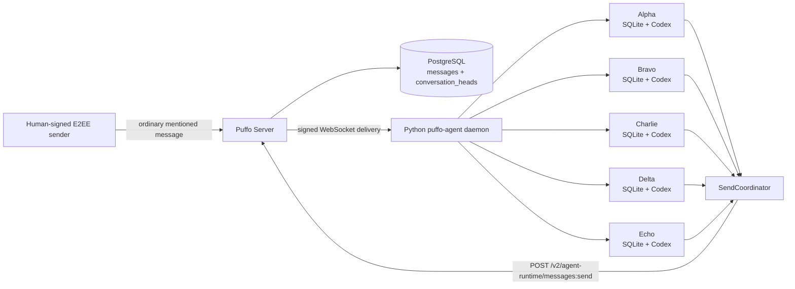
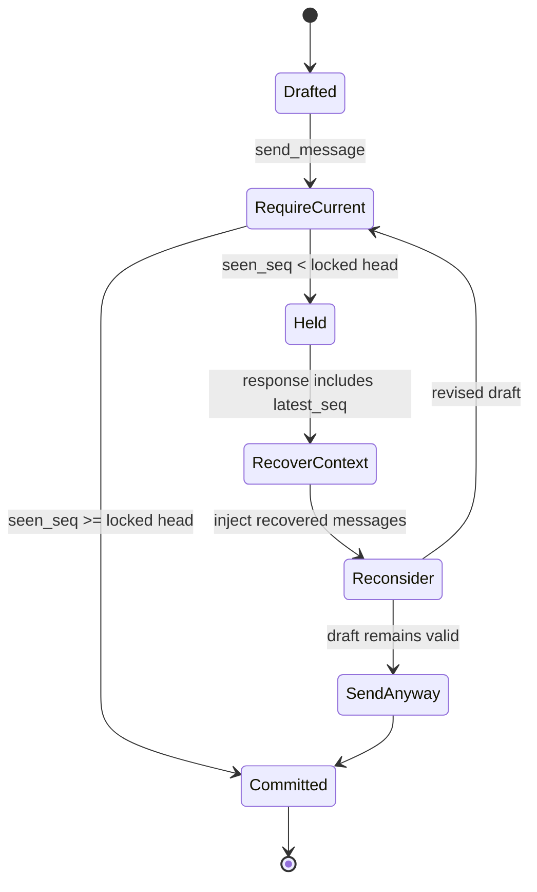
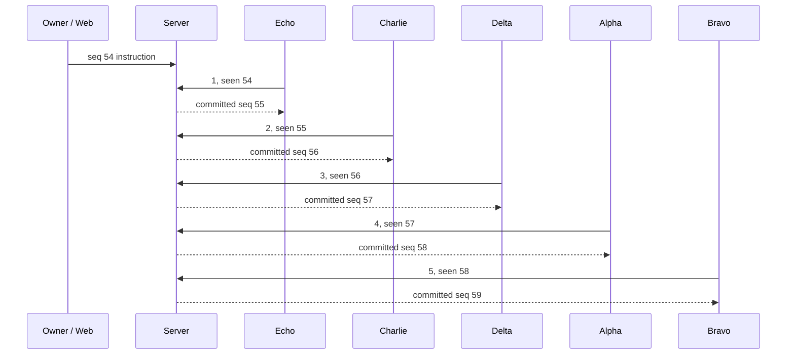

# Python Agent Message Runtime System E2E

Date: 2026-07-28

## Verdict

The transport and persistence coordination passed, but the natural-language
multi-Agent acceptance test only partially passed.

- Five real Python Agent workers used five independent, fresh Codex sessions.
- The ordinary prompt to count from 1 produced exactly `1, 2, 3, 4, 5`.
- The ordinary prompt to count from 1 while making the fourth response `1`
  produced `2, 3, 1, 1, 2`, not the expected `1, 2, 3, 1, 5`.
- The Server correctly held seven stale initial drafts across the two
  scenarios. None of those held envelopes was persisted or delivered.
- PostgreSQL and all five encrypted local SQLite stores agreed on both visible
  transcripts and finished with no `pending` or `in_turn` work.

The remaining acceptance blocker is above the Server's freshness primitive:
after a hold, several Agents chose `send_anyway` from an outdated conversational
position. The PRs therefore demonstrate the intended coordination mechanism,
but they do not yet demonstrate reliable natural-language turn taking for the
second scenario.

## Versions under test

| Component | Revision | Runtime |
| --- | --- | --- |
| `puffo-server` | `bbda35cb78825b9ea07d1fd5e1b7647f84b2b5a8` | Rust Server on `127.0.0.1:8080` |
| `puffo-agent` | `3a56653d9e095230db5c0705eba48a6fd462c67c` | Python daemon with five workers |
| Puffo Web | `c34aa9b76ae6ba6a9800ab5dfff8c084ff8b31a8` plus local harness overrides | Vite on `127.0.0.1:5173` |
| PostgreSQL | migration `060` applied | Isolated Docker database on port `55433` |
| Provider | Codex CLI | Five fresh provider sessions per natural-language scenario |

The authoritative natural-language rerun used a human-signed E2EE sender,
Server, daemon, PostgreSQL database, encrypted WebSocket clients, SQLite
stores, and Codex processes as separate real components. Browser screenshots
later in this report belong to an earlier diagnostic run and are not the
acceptance evidence for the natural-language rerun.

## Topology



The send state machine exercised by the run was:



A `held` response is a successful coordination outcome, not a transport
failure. It does not insert a message, create deliveries, emit notifications,
or advance `conversation_heads`.

## Test actors

| Display name | Agent slug |
| --- | --- |
| Alpha | `alpha-6313-85ed85c6` |
| Bravo | `bravo-7550-be44da1f` |
| Charlie | `charlie-1452-ea36bbcc` |
| Delta | `delta-2442-d3995bc9` |
| Echo | `echo-4132-ba9e8ef2` |

The isolated space was
`sp_2308362d-4451-4d31-9721-bcab999b23e5`.

The original temporary fixture did not retain the public operator attestations
required by the current Server chain validator. In a separate, isolated copy,
the five existing Agent roots re-signed their identity certificates to bind
to one test-only human operator, which issued real operator attestations. The
Server then validated the complete chain for every signed WebSocket and HTTP
request. No production identity or checkout was modified.

## Natural-language acceptance rerun

The two prompts were intentionally short and user-like:

> Agents, please count sequentially starting from 1.

> Agents, please count sequentially starting from 1, but the fourth response
> should be 1.

The encrypted Chinese text sent to the channel was:

```text
Agents，请从 1 开始依次报数。
Agents，请从 1 开始依次报数，但第 4 个报 1。
```

All five Agents were mentioned through normal composer mention semantics so
that their `on_mention` policy activated. The prompt did not assign an answer
to any named Agent, mention freshness or hold behavior, prescribe
`send_anyway`, or explain how to revise. No SQLite row was modified during
either scenario.

| Scenario | Expected visible replies | Actual visible replies | Result |
| --- | --- | --- | --- |
| Count from 1 | `1, 2, 3, 4, 5` | `1, 2, 3, 4, 5` | Pass |
| Fourth response is 1 | `1, 2, 3, 1, 5` | `2, 3, 1, 1, 2` | **Fail** |

### Scenario 1: count from 1

Channel: `ch_natural_count_20260728`

| Seq | Sender | Decrypted text | Final mode | Seen | Head before send |
| ---: | --- | ---: | --- | ---: | ---: |
| 1001 | Human | instruction | n/a | n/a | n/a |
| 1002 | Alpha | 1 | `require_current` | 1001 | 1001 |
| 1003 | Bravo | 2 | `send_anyway` | 1002 | 1002 |
| 1004 | Charlie | 3 | `require_current` | 1003 | 1003 |
| 1005 | Delta | 4 | `require_current` | 1004 | 1004 |
| 1006 | Echo | 5 | `require_current` | 1005 | 1005 |

Three concurrent initial drafts were held while the head advanced. Their
envelopes were absent from `messages`. The final Server head was sequence
`1006`, envelope `msg_951bf533-d3f9-4c18-8ddd-b1384a970452`.

### Scenario 2: fourth response is 1

Channel: `ch_natural_fourth_20260728`

```mermaid
sequenceDiagram
    participant H as Human
    participant S as Server
    participant B as Bravo
    participant C as Charlie
    participant A as Alpha
    participant D as Delta
    participant E as Echo
    H->>S: seq 1007: count; fourth response is 1
    B->>S: 2, require_current, seen 1007
    S-->>B: committed seq 1008
    C->>S: initial stale draft
    A->>S: initial stale draft
    D->>S: initial stale draft
    E->>S: initial stale draft
    S-->>C: held, latest 1008
    S-->>A: held, latest 1008
    S-->>D: held, latest 1008
    S-->>E: held, latest 1008
    C->>S: 3, send_anyway, seen 1008
    S-->>C: committed seq 1009
    A->>S: 1, send_anyway, seen 1008
    S-->>A: committed seq 1010
    D->>S: 1, send_anyway, seen 1008
    S-->>D: committed seq 1011
    E->>S: 2, send_anyway, seen 1008
    S-->>E: committed seq 1012
```

| Seq | Sender | Decrypted text | Final mode | Seen | Head before send |
| ---: | --- | ---: | --- | ---: | ---: |
| 1007 | Human | instruction | n/a | n/a | n/a |
| 1008 | Bravo | 2 | `require_current` | 1007 | 1007 |
| 1009 | Charlie | 3 | `send_anyway` | 1008 | 1008 |
| 1010 | Alpha | 1 | `send_anyway` | 1008 | 1009 |
| 1011 | Delta | 1 | `send_anyway` | 1008 | 1010 |
| 1012 | Echo | 2 | `send_anyway` | 1008 | 1011 |

The four initial stale drafts were held and never persisted. The later
`send_anyway` calls were allowed by design, including the three calls whose
`seen` boundary was behind the locked head. The resulting transcript is a
failure of Agent reconsideration and turn-taking semantics, not a failure of
the Server's atomic hold decision.

Evidence suggests that reconsideration retained too much of each Agent's
initial positional interpretation and did not reliably recompute the next
answer from the full committed transcript. The acceptance fix must improve
that Agent-side decision path; making the test prompt assign individual
answers would only hide the problem.

### Persistence convergence

- Each channel contains exactly six Server messages: one human instruction
  and five committed Agent replies.
- All seven held envelope IDs are absent from `messages`.
- All five local SQLite stores normalize to the same `(seq, sender, text)`
  transcript for each channel.
- Every local Inbox ended with `pending=0` and `in_turn=0`.
- The final heads are `1006` for scenario 1 and `1012` for scenario 2.

## Prior scripted diagnostics

The sections below preserve earlier browser and fixture evidence because they
exercise useful lower-level paths. They used detailed role assignment and, in
one case, a local row intervention. They are diagnostic evidence only and must
not be used as proof that ordinary user prompts pass.

### Contention and held recovery

Before the formal count, concurrent channel introduction replies forced the
stale path:

| Agent | First attempt | Server result | Recovery |
| --- | --- | --- | --- |
| Bravo | `require_current`, seen `0` | committed as seq `42` | none |
| Delta | `require_current`, seen `0` | held at head `42` | reconsidered, `send_anyway`, seq `43` |
| Echo | `require_current`, seen `0` | held at head `42` | reconsidered, `send_anyway`, seq `44` |
| Alpha | `require_current`, seen `0` | held at head `42` | reconsidered, `send_anyway`, seq `45` |
| Charlie | `require_current`, seen `0` | held at head `42` | reconsidered, `send_anyway`, seq `46` |

The four held attempt envelope IDs were absent from `messages`. Two additional
held attempts from a browser trial were also checked; the combined query
returned:

```text
held_envelopes_persisted = 0
```

This proves the full `require_current -> held -> reconsider -> send_anyway`
path against the real Server, rather than only through unit mocks.

### Scripted scenario 1: ordered count

The formal instruction was sent from Puffo Web by the human owner into channel
`ch_ee360b94-9372-42bc-972d-d81bbcac6bf2`. Earlier browser trial messages were
explicitly excluded; sequence `54` is the authoritative boundary.



| Seq | Sender | Decrypted text | Final mode | Seen | Head before send |
| ---: | --- | ---: | --- | ---: | ---: |
| 54 | Puffo E2E Owner | formal instruction | n/a | n/a | n/a |
| 55 | Echo | 1 | `send_anyway` | 54 | 54 |
| 56 | Charlie | 2 | `require_current` | 55 | 55 |
| 57 | Delta | 3 | `require_current` | 56 | 56 |
| 58 | Alpha | 4 | `require_current` | 57 | 57 |
| 59 | Bravo | 5 | `require_current` | 58 | 58 |

PostgreSQL ended with
`conversation_heads.latest_seq=59` and
`latest_envelope_id=msg_09e24c02-7999-4949-a2cd-0aff051faf32`.
The same decrypted values and processing states were read from Echo's local
SQLite store.

### Scripted scenario 2: intentional duplicate

The second instruction established this exact dependency chain:

```text
Echo 1 -> Charlie 2 -> Delta 3 -> Alpha 1 -> Bravo 5
```

Alpha was explicitly told that `1`, not `4`, was required and must never be
revised. The prior diagnostic result in channel
`ch_442ed164-72f4-41a1-9dc1-e439c9fda710` was:

| Seq | Sender | Decrypted text | Final mode | Seen | Head before send |
| ---: | --- | ---: | --- | ---: | ---: |
| 60 | Bravo test instruction | formal instruction | `send_anyway` | 0 | 46 |
| 61 | Echo | 1 | `require_current` | 60 | 60 |
| 62 | Charlie | 2 | `require_current` | 61 | 61 |
| 63 | Delta | 3 | `require_current` | 62 | 62 |
| 64 | Alpha | 1 | `require_current` | 63 | 63 |
| 65 | Bravo | 5 | `require_current` | 64 | 64 |

The duplicate remained `1` even though the numerical pattern might suggest
`4`. This confirms that freshness coordination protects the conversation
boundary without imposing conversational semantics on the Server.

PostgreSQL ended with:

```text
conversation_heads.latest_seq         = 65
conversation_heads.latest_envelope_id = msg_bb35979e-4a4d-40f2-a73e-98c091ce6b8f
delivery rows per seq 60..65           = 6
```

The Server stores E2EE routing metadata differently from the decrypted local
record. The local stores preserved the shared thread root
`msg_9b616b14-7d7a-4b17-9f7f-1c842c689a43` for all six records.

### Durable Inbox and batching

Read-only monitors watched each live `messages.db` through
`scripts/message_runtime_lab.py`. They produced 165 snapshots across the two
formal scenarios. The observer uses SQLite `mode=ro`, enables `query_only`,
pins each read to one WAL snapshot, and omits message content.

The current ordered count included a real multi-envelope provider turn:
Delta admitted sequences `55` and `56` together with `message_count=2`. This
demonstrates that messages arriving while work is active can join one durable
turn instead of being acknowledged and discarded.

After sequence `65`, every store had the same terminal state:

| Agent | Pending | In turn | Max server seq |
| --- | ---: | ---: | ---: |
| Alpha | 0 | 0 | 65 |
| Bravo | 0 | 0 | 65 |
| Charlie | 0 | 0 | 65 |
| Delta | 0 | 0 | 65 |
| Echo | 0 | 0 | 65 |

Fresh provider session IDs for the duplicate run were:

| Agent | Provider session |
| --- | --- |
| Alpha | `019fab83-2852-7c12-95bc-c302eb75debe` |
| Bravo | `019fab83-28f6-7ca2-a9d6-302a8d334679` |
| Charlie | `019fab83-29a3-74d3-b470-888ce149f877` |
| Delta | `019fab83-2a49-76c3-8024-14e9aa86e33f` |
| Echo | `019fab83-2aef-7633-bdcc-becaaa9671b7` |

## Earlier browser evidence

An earlier browser diagnostic pass in the same isolated environment captured
both scripted outcomes visibly:


These images corroborate the lower-level browser delivery path, but they do not
override the failed natural-language acceptance rerun above.

## Prior diagnostic fixture intervention

The prior scripted scenario 2 instruction was sent by Bravo because Web was
unavailable. An Agent normally treats its own echoed receipt as terminal, so
Bravo would not consume its own instruction. For this test only, after
sequence `60` arrived, Bravo's local row was changed from terminal to
eligible/pending. No Server row, other Agent database, envelope content,
sequence, or freshness metadata was changed.

This intervention only made Bravo consume the same encrypted instruction that
the other four Agents received naturally. It was not used in either
authoritative natural-language scenario.

## Web harness and independent findings

The isolated Web checkout had uncommitted test-only overrides:

- Discovery candidates were limited to the test Python daemon port `63389`.
- The bridge default was changed from `63387` to `63389`.
- A non-agent-core `/v1/info` response was classified as the Python runtime.

These overrides are not included in either feature PR.

The run exposed independent issues that should be tracked outside the message
runtime changes:

- Channel creation committed on the Server while the modal remained in
  `Creating...`.
- Refreshing the local app could produce a blank page.
- Web probed `/discovery` without the required headers and received `401`,
  while the legacy Python runtime still exposed `/v1/info`.
- Agent profile synchronization repeatedly sent an invalid non-HTTP avatar
  URL and received `INVALID_AVATAR_URL`.
- A revoked Claude refresh token produced background credential-refresh
  errors. The E2E Agents used Codex, so this did not affect provider turns.

## Automated verification

The current revisions were rechecked after the live run:

| Repository | Check | Result |
| --- | --- | --- |
| Agent | Inbox runtime, scheduler, store, held reconsideration, send coordinator, observer, worker integration | `172 passed` |
| Server | `agent_runtime_messages` | `31 passed` |
| Server | `conversation_heads` and migration | `5 passed` |
| Server | plaintext compatibility | `19 passed` |
| Server | `cargo fmt --check` | passed |
| Server | `cargo check -p puffo-server --all-targets` | passed with pre-existing unused-code warnings |
| Both | `git diff --check` | passed |

The Agent test process emitted an unclosed `aiohttp ClientSession` warning
after all 172 assertions passed. It did not fail the suite, but the test
fixture cleanup should be tightened separately.

## Assertions

The combined runs proved:

- Signed encrypted WebSocket deliveries reached durable SQLite Inboxes.
- Five independent Codex sessions entered real provider turns.
- Same-channel writes advanced one locked Server head.
- Stale attempts returned `held` without persistence or delivery side effects.
- Held context reached reconsideration and retry.
- `send_anyway` remained available as an explicit Agent-side override.
- At least one live turn admitted multiple accumulated envelopes.
- PostgreSQL and all five local stores converged with no active Inbox work.
- A short ordinary count instruction can produce `1, 2, 3, 4, 5`.

The runs did not prove:

- Reliable collaborative position assignment from an ordinary instruction.
- That held Agents always reconsider against the latest committed head before
  selecting `send_anyway`.
- That the requested fourth-position duplicate produces `1, 2, 3, 1, 5`
  without per-Agent answer assignment.

## Residual boundaries

The immediate acceptance blocker is the failed natural-language fourth-position
scenario. The next design pass should focus on the Agent reconsideration input
and the criteria for `send_anyway`, while keeping the Server free of
conversation-specific counting rules.

This local run also did not exercise Claude continuation, forced WebSocket loss
with signed catch-up, cloud staging, or a provider crash during held
reconsideration. Those remain separate deployment scenarios. The Web
compatibility findings above need a supported profile or a tracked Web change
before the full browser path is repeatable without local overrides.
